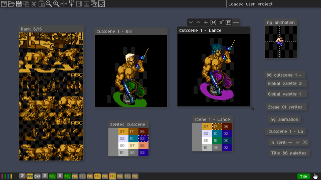
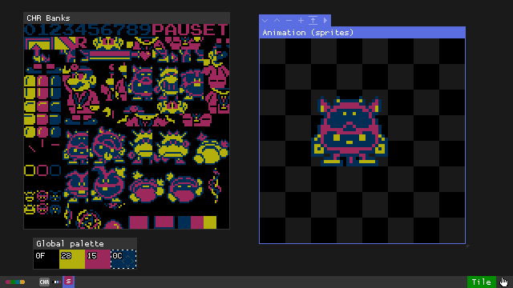
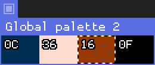
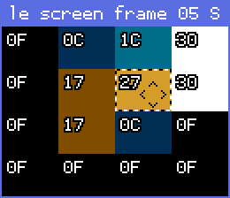
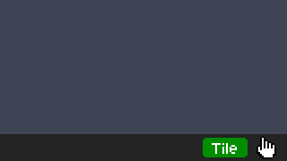
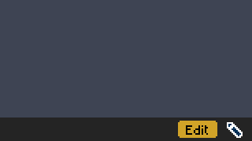
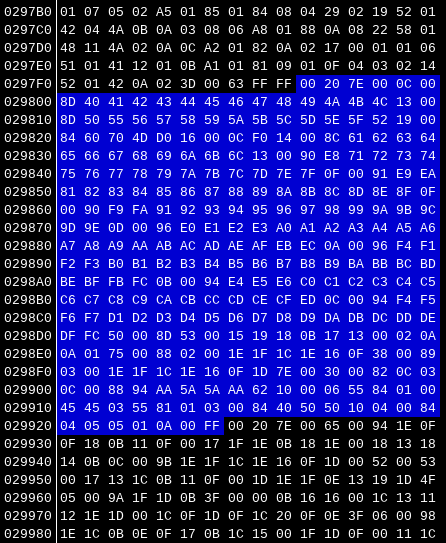
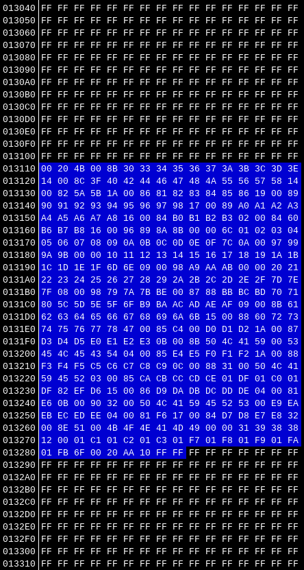

## Open Source NES Art Editor

Version: 0.0.7



Edit NES graphics in game-aware context instead of rebuilding screens by hand.

PPUX uses an in-app [database](#database) plus project files to understand banks, palettes, sprite layouts, animations, and other ROM-specific structures.

- [Basic Usage](#basic-usage)
  - [Getting started](#getting-started)
  - [Windows system](#windows-system)
  - [Palette windows](#palette-windows)
  - [Main controls](#main-controls)
  - [Tile mode](#tile-mode)
  - [Edit mode](#edit-mode)
- [Advanced](#advanced)
  - [Build packages](#build-packages)
  - [Database](#database)
  - [DB contribution tracker](#db-contribution-tracker)
  - [Lua project mapping](#lua-project-mapping)
  - [Byte budget for PPU Frame windows](#byte-budget-for-ppu-frame-windows)
  - [Current nametable codec coverage](#current-nametable-codec-coverage)
  - [ROM patches](#rom-patches)
- [Development](#development)
  - [Unit testing](#unit-testing)
  - [E2E testing](#e2e-testing)

## Basic Usage

### Getting started

Create a folder, place your ROM inside it, then drag the ROM into PPUX. After that, the app will either:

1. Open a default layout
2. Open a DB-backed game layout
3. Load an existing user project (`.lua` or `.ppux`)

If a ROM has no DB entry yet, it can still be used normally. DB entries are just curated starting points.

Example with an animation for Dr. Mario, this can be done in 2 or 3 minutes:



### Windows system

Windows are the main work areas in PPUX. Some are source windows, some are layout windows, and some are ROM-backed helper windows.

| Window                 | Taskbar icon                                                                                                             | Description                                                                                              |
| ---------------------- | ------------------------------------------------------------------------------------------------------------------------ | ---------------------------------------------------------------------------------------------------------|
| CHR Banks              |                       | Primary source window for normal CHR bank data                                                           |
| ROM Banks              |                       | Same as CHR Banks, but loads the whole ROM                                                               |
| Static Art (tiles)     |        | Single-layer tile composition window for mockups and UI pieces                                           |
| Animation (tiles)      |                         | Tile animation window where each layer acts as a frame                                                   |
| Static Art (sprites)   |    | Single-layer sprite composition window with pixel-level placement                                        |
| Animation (sprites)    |                       | Sprite animation window for frame-by-frame sprite layouts                                                |
| OAM Animation          |                           | ROM-backed sprite animation view based on OAM data                                                       |
| Palette                |                     | Global palette window for items without an assigned palette                                              |
| ROM Palette            |             | Palette editor tied to ROM addresses                                                                     |
| PPU Frame              |                 | ROM-backed nametable and sprite view for screens assembled closer to how the game actually renders them  |


Notes: 

* To be clearer on CHR vs ROM windows: CHR Banks is the normal source browser containing only graphics data.

* ROM Banks is the fallback source browser, useful for Games that use CHR RAM data (like Megaman 2, for instance) and, as mentioned above, it will load the whole ROM, so be careful on unintentional non-graphics pixel edits.

* Not all window types can currently be created through the UI. ROM-backed windows that depend on ROM addresses and related metadata still need to be created manually in Lua project files for now, but this will be improved.

### Palette windows

Palette windows control how indexed NES colors are shown and edited in the rest of the workspace.





There are 2 palette window types:

* `Palette`: a global palette window. This is the fallback palette source for items and layers that do not point to a specific ROM palette window.
* `ROM Palette`: a ROM-backed `4x4` palette editor. Each cell is tied to ROM addresses, so changing a color there changes the actual ROM-backed palette data used by linked windows.

How they behave:

* A normal `Palette` window is mainly for viewing and choosing the active editing color in a simple global way.
* A `ROM Palette` window is for real game palettes. Tile and sprite layers can link to one through `paletteData = { winId = "..." }`.
* When a layer is linked to a `ROM Palette` window, shader rendering, previews, and palette-numbered tiles/sprites use that palette data.
* Palette numbers `1` to `4` choose which row/palette set is used on layers that support per-item palette assignment.
* The first column in a ROM palette is usually the shared background color.

Practical workflow:

* Use a global `Palette` window when you just want a quick working palette for mockups or unlinked content.
* Use `ROM Palette` windows when editing real in-game screens, sprites, and `ppu_frame` windows that should reflect actual ROM palette bytes.
* Click a color in a palette window to make it the active paint color.
* In edit mode, using grab-color on art can also move the selection in the active palette window when applicable.
* In palette windows, arrow keys move the selected palette cell.
* In palette windows, `Shift + arrows` adjusts the selected palette color.
* Mouse wheel over a palette window also adjusts palette colors.
* `Shift + mouse wheel` adjusts palette colors horizontally in palette windows.

### Main controls

- `Ctrl + 1/2/3`: change app scale
- `Ctrl + F`: toggle fullscreen
- `Ctrl + N`: open `New Window`
- `Ctrl + S`: open save options
- `Tab`: toggle `Tile` / `Edit` mode
- `Ctrl + G`: toggle the focused window grid
- `Ctrl + R`: toggle shader rendering for the focused layer
- `Ctrl + Z` / `Ctrl + Y`: undo / redo
- `Right click` or `middle click` drag: move windows
- taskbar: focus, restore, and manage windows

### Tile mode



Tile mode is for selection, drag and drop and tile-level editing in general.

- left click to select
- `Ctrl + click` or `Shift + drag` for multi-selection
- `Ctrl + A` to select all
- `Delete` / `Backspace` to remove selection where supported
- arrows to move tile selections
- `Shift + Up/Down` to switch layers
- `Ctrl + Up/Down` to change inactive-layer opacity
- `1` to `4` to assign palette numbers where supported
- `H` / `V` to mirror selected sprites
- bank windows: `Left/Right` switch banks, `M` toggles `8x8` / `8x16`

### Edit mode



Edit mode is for pixel-level editing.

- left click to paint
- `Shift + click` draws a line from the last painted/clicked point
- `Shift + click drag` paints a filled rectangle
- `R` toggles the rectangle fill tool
- hold `G` and left click or drag to grab a color
- hold `F` and left click to flood fill
- `1` to `4` to choose the active color
- `Alt + 1/2/3/4` to change brush size presets
- `Ctrl + Alt + mouse wheel` also changes brush size
- `Ctrl + R` toggles shader rendering for the focused layer
- `Ctrl + G` toggles the focused window grid
- `Ctrl + Z` / `Ctrl + Y`: undo / redo

### PNG drops

You can drag and drop a PNG directly into PPUX. What happens depends on the window under the mouse, and sometimes on the focused window.

Sprite windows:

* If the target window has a sprite layer, the PNG is treated as a sprite import.
* If you have selected sprites, PPUX imports into those sprites in selection order.
* If no sprites are selected, PPUX imports into the layer's sprites from first to last.
* The PNG must use at most 4 total colors including transparency, or at most 3 non-transparent colors.
* The PNG dimensions must align to the current sprite mode: `8x8` sprites require multiples of `8x8`, and `8x16` sprites require multiples of `8x16`.
* The image is split into sprite-sized frames from left to right, top to bottom.
* Fully transparent frames are skipped.
* When importing into an unselected sprite layer, PPUX also repositions sprites to match the frame grid automatically.

PPU Frame windows:

* Dropping a PNG on a `ppu_frame` window runs the nametable unscramble/import flow for that screen (it matches the PNG against the current patterns in CHR/ROM window and tries to automatically build the actual nametable layout)

CHR and ROM bank windows:

* Dropping a PNG on a CHR-like source window imports the image into the selected tile position, or the top-left if nothing is selected.

Notes:

* PNG drops edit the project/app state and are written out when you save, just like normal tile or sprite pixel edits.
* If the PNG does not meet the color or size rules, PPUX shows a status message explaining why it was rejected.

## Advanced

### Build packages

To build a packaged Windows app from Windows, run:

```bat
scripts\build_windows.bat
```

The packaged Windows app will be created only as `build\PPUX-<version>-win64.zip`.

To build a packaged Linux app from Linux, run:

```bash
./scripts/build_linux_appimage.sh
```

The packaged Linux app will be created as `build/PPUX-<version>-x86_64.AppImage`.

You can also build for Windows and macOS from Linux using `./scripts/build_all.sh` (macOS build not tested yet).

### Database

The DB lets PPUX recognize specific ROMs and open a tailored starting workspace automatically.

DB entries are matched by ROM SHA-1 and can define open windows, relevant CHR banks, palette windows, ROM-backed views, and the initial workspace arrangement. If no DB entry exists, PPUX falls back to a default layout. User projects (*.lua and *.ppux) take priority over DB defaults.

Current list of games

* Contra (Japan) is in progress  - About 20%

* Kirby's Adventure (USA) (Rev 1) - Not started yet

* The Guardian Legend (USA) - Not started yet

NOTE: This is currenly in beta so please be patient while the list is still being expanded

### DB contribution tracker

The [DB contribution tracker sheet](https://docs.google.com/spreadsheets/d/1uxwTMG9cmv7juRGnYeg7M8aFsWqMgMWwBduhdpviIm4/edit?gid=1408935396#gid=1408935396) is a shared place to track which games already have DB coverage, which ones are in progress, pending, etc.

Use it to coordinate contributions, avoid duplicate effort, and leave notes about the current status of a game-specific DB entry.

### Lua project mapping

Lua project files are plain Lua tables returned from `<rom>.lua`:

```lua
return {
  kind = "project",
  projectVersion = 1,
  currentBank = 1,
  focusedWindowId = "bank",
  edits = {},
  windows = {}
}
```

The most important fields are windows and edits. For windows, common fields include kind, id, title, x/y/z, zoom, workspace size, viewport size, scroll position, and layer state.

For edits, the data stores per-bank, per-tile pixel edits applied on top of the source ROM data, using a compact compressed format.

The recommended workflow is to save once from the UI, use the generated project (*.lua or *.ppux) as the template, then create windows, layouts, edits, etc, and keep the project growing as you wish (either for personal use, sharing or even for a new DB entry PR).

Notes:

* PPUX never overwrites the original ROM. Pixel edits and other byte changes (like patches, palette color changes, etc) are written as `<rom>_edited.nes`.

* Project files are saved either as `<rom>.lua` and `<rom>.ppux`.

* `*.ppux` files are just zlib-compressed versions of Lua project files, useful when you want smaller files or prefer not to keep the project contents easily readable.

Best practice: keep the base ROM, edited ROM, and project files in the same folder.

### PPU frame windows

`ppu_frame` windows are structured screen views. They usually contain one tile layer backed by a compressed nametable stream and, optionally, one sprite overlay layer.

Example:

```lua
{
  kind = "ppu_frame",
  id = "ppu_01",
  layers = {
    [1] = {
      kind = "tile",
      bank = 9,
      nametableEndAddr = 0x01329B,
      nametableStartAddr = 0x013110,
      paletteData = { winId = "rom_palette_01" }
    },
    [2] = {
      kind = "sprite",
      mode = "8x16",
      items = {
        { startAddr = 0x009F2B, bank = 4, tile = 238 },
        ...
      }
    },
    ...
  }
}
```

In tile layers, `nametableStartAddr` and `nametableEndAddr` define the ROM byte range used for the nametable data handled by that window (it's the same bytes read by an emulator when loading a specific nametable). The app reads from that range when loading the screen data, and writes back into the same range when saving changes.

For sprite layers, `startAddr` is the most important field because it links the item to the 4 OAM bytes in ROM. The app uses byte 1 for Y position, byte 3 for attributes/palette/mirroring, and byte 4 for X position directly through the app UI. Byte 2 is the exception: in real hardware or emulators, its tile value is interpreted in PPU/VRAM space, not as a direct ROM-bank tile reference. Since the app does not know the final runtime VRAM page layout, bank and tile must also be specified explicitly so the correct source graphics can be resolved in the editor context.

### Byte budget for PPU Frame windows

PPU Frame tile layers support `noOverflowSupported = true`. This means the compressed nametable stream should stay within its original ROM byte budget.

Why it matters: some games leave safe free space after the stream, and some do not.

TMNT II is a good example of this: compressed byte ranges are packed tightly, so PPUX reads one nametable from a defined range while the next nametable begins immediately after it:



Contra (J) example, where the byte "buffer" has plenty of space:



PPUX warns when the compressed stream goes over budget and clears the warning if it returns to a valid size.

### Current nametable codec coverage

PPUX currently includes one nametable codec implementation aimed at Konami-style streams (konami.lua). New codecs for different games/styles will be added as the app development progresses.

### OAM animation windows

`oam_animation` windows are ROM-backed sprite animation windows where each layer is effectively one frame.

Example:

```lua
{
  kind = "oam_animation",
  id = "oam_animation_01",
  layers = {
    [1] = {
      kind = "sprite",
      mode = "8x16",
      items = {
        { startAddr = 0x0095FA, bank = 1, tile = 256 },
        ...
      }
    },
    ...
  }
}
```

Important fields are frame timing (`delaysPerLayer`), sprite frames (`layers`), local origin, palette source, and ROM-backed `startAddr` entries.

### ROM palette windows

`rom_palette` windows are `4x4` palette editors backed directly by ROM addresses.

Example:

```lua
{
  kind = "rom_palette",
  paletteData = {
    romColors = {
      [1] = { 0x01F688, 0x0112ED, 0x0112EE, 0x0112EF },
      [2] = { 0x01F688, 0x0112F0, 0x0112F1, 0x0112F2 },
      [3] = { 0x01F688, 0x0112ED, 0x0112EE, 0x011243 },
      [4] = { 0x01F688, 0x0112F0, 0x0112F1, 0x011252 },
    }
  }
}
```

So each `romColors[row][col]` stores a ROM address for a given palette color. The first column is the universal background color, usually one single "shared" ROM address.

### Window references between entries

Some windows refer to other windows by `id`, for example:

```lua
paletteData = {
  winId = "rom_palette_02"
}
```

The referenced window must exist elsewhere in the same `windows` array and will be used as the palette source.

### ROM patches

PPUX can apply small ROM patches from project data before windows are built (so the user is already working on top of "patched" ROM).

This is meant for targeted graphics-related setup such as forcing a game state or changing a small byte sequence. It is not a replacement for a full ROM hacking workflow.

## Development

### Unit testing

PPUX includes a unit test suite. See [Unit Testing](docs/test/UNIT_TESTING.md).

### E2E testing

PPUX also includes visible end-to-end test scenarios that boot the real app. See [E2E Testing](docs/test/E2E_TESTING.md).

---

**Detailed video tutorials are planned.**

Dev notes:

* Create a shader google sheet so people can add themselves and indicate which game(s) they'll add to the DB (DONE)
* Add Tiles mode for windows (similar to "Tiling" windows managers on Linux)
* Add more e2e tests (DONE, needs more tho)
* Add a compressed version of the lua project, maybe *.ppux (DONE)
* Separate DB into per-game Lua files (DONE)
* Add a "recently loaded" list in main menu (DONE)
* Re-structure main menu into sub-menus (DONE)
* Add contextual menus for windows and empty space (DONE-ish)
* Standarize modals to use panel as a base, and make panels more robust/flexible (DONE)
* Fix issue: project loading way to many items when project was saved with CHR sync ON (FIXED)
* Be able to create and populate/configure OAM/ROM-backed windows thru the UI (big task, needs split)
