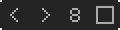
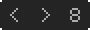
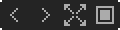
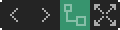
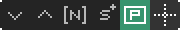
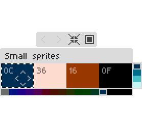
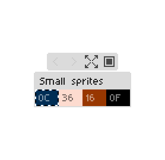
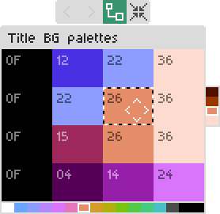
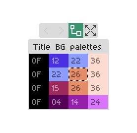
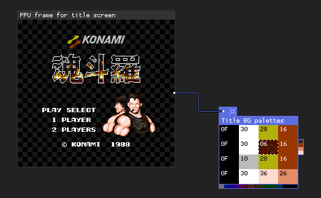

## Open Source NES Art Editor

Version: 0.1.0 (beta)


Edit NES graphics in game-aware context instead of rebuilding screens by hand.

PPUX uses an in-app [database](#database) plus project files to understand banks, palettes, sprite layouts, animations, and other ROM-specific structures.

:information_source: If you wish to support the project, you can do so [here](https://tavuntu.itch.io/ppux).

- [Basic Usage](#basic-usage)
  - [Getting started](#getting-started)
  - [Windows system](#windows-system)
  - [Toolbars](#toolbars)
  - [Palette windows](#palette-windows)
  - [Main controls](#main-controls)
  - [Tile mode](#tile-mode)
  - [Edit mode](#edit-mode)
  - [PNG drops](#png-drops)
- [Advanced](#advanced)
  - [Database](#database)
  - [DB contribution tracker](#db-contribution-tracker)
  - [Lua project mapping](#lua-project-mapping)
  - [PPU frame windows](#ppu-frame-windows)
  - [PPU frame editing notes](#ppu-frame-editing-notes)
  - [OAM animation windows](#oam-animation-windows)
  - [ROM palette windows](#rom-palette-windows)
  - [Window references between entries](#window-references-between-entries)
  - [Byte budget for PPU Frame windows](#byte-budget-for-ppu-frame-windows)
  - [Current nametable codec coverage](#current-nametable-codec-coverage)
  - [ROM patches](#rom-patches)
- [Development](#development)
  - [Build packages](#build-packages)
  - [Unit testing](#unit-testing)
  - [E2E testing](#e2e-testing)

## Basic Usage

### Getting started

Create a folder, place your ROM inside it, then drag the ROM into PPUX. After that, the app will either:

1. Open a default layout
2. Open a DB layout
3. Open a *.lua or *.ppux user project (if any)

NOTE: You can also open a project any time from the top app toolbar (`Open` button). This opens the **Open Project** browser modal.

If a ROM has no DB entry yet, it can still be used normally. DB entries are just curated starting points. That said, any user can "pick" a game and start working on a user project that can be used for a new DB entry Pull Request. [See this section](#db-contribution-tracker).

### Windows system

Windows are the main work areas in PPUX. Some are source windows, some are layout windows, and some are ROM-backed helper windows.

| Window                 | Taskbar icon                                                                                                             | Description                                                                                              |
| ---------------------- | ------------------------------------------------------------------------------------------------------------------------ | ---------------------------------------------------------------------------------------------------------|
| CHR Banks              |                       | Primary source window for normal CHR bank data                                                           |
| ROM Banks              |                       | Same as CHR Banks, but loads the whole ROM                                                               |
| Static Art (tiles)     |        | Single-layer tile composition window for mockups and UI pieces                                           |
| Animation (tiles)      |                         | Tile animation window where each layer acts as a frame                                                   |
| Static Art (sprites)   |    | Single-layer sprite composition window with pixel-level placement                                        |
| Animation (sprites)    |                       | Sprite animation window for frame-by-frame sprite layouts                                                |
| OAM Animation          |                           | ROM-backed sprite animation view based on OAM data                                                       |
| Global palette         |              | Global palette window for items without an assigned ROM palette                                          |
| ROM palette            |             | ROM palette editor tied to ROM addresses                                                                 |
| PPU Frame              |                 | ROM-backed nametable and sprite view for screens assembled closer to how the game actually renders them  |


Notes: 

* To be clearer on CHR vs ROM windows: CHR Banks is the normal source browser containing only graphics data.

* ROM Banks is the fallback source browser, useful for Games that use CHR RAM data (like Megaman 2, for instance) and, as mentioned above, it will load the whole ROM, so be careful on unintentional non-graphics pixel edits.

* You can create a window from **New Window** (`Ctrl + N`) when a project/ROM is open (top toolbar button and taskbar menu entry).

### Toolbars

Windows include a slim toolbar strip just above the header. It holds small icon buttons whose actions depend on the window type. Every control should show a tooltip on hover, but it still helps to spell out what each button does in the docs so people can learn the layout without hovering everything.


#### CHR Banks toolbar



1. **Previous bank** — `Left`
2. **Next bank** — `Right`
3. **Tile layout (8x8 / 8x16)** — straight `8x8` rows vs paired `8x16` layout — `M`
4. **Sync duplicate tiles** — on: identical tiles edit together; off: independent cells

#### ROM Banks toolbar



Same navigation and layout toggle as CHR, **no** sync control (full-ROM surface).

1. **Previous bank** — `Left`
2. **Next bank** — `Right`
3. **Tile layout (8x8 / 8x16)** — `M`

#### Static Art (tiles) toolbar


1. **Palette link handle** — drag onto a **ROM palette** window (connect handle or anywhere on that window), **or** drag from the ROM palette’s handle onto this window; **right-click** for more specific options

#### Static Art (sprites) toolbar


1. **Palette link handle** — effectively same as Static Art for tiles

#### Animation (tiles) toolbar


**Animation (both tiles and sprites)**. **`Shift` + `Up` / `Down`** (`Up` → next frame, `Down` → previous). **`Shift` + `Left` / `Right`** adjusts **all frame delays** together when the window supports it.

1. **Palette link handle**
2. **Previous layer** — `Shift` + `Down`
3. **Next layer** — `Shift` + `Up`
4. **Remove layer** — only when more than one frame exists — `-`
5. **Add layer** — `+`
6. **Copy from previous layer**
7. **Play / Pause** — `P` (any case)


#### OAM Animation toolbar


**`Shift` + `Up` / `Down`** steps frames (`Up` next, `Down` previous; disabled while playing). **`Shift` + `Left` / `Right`** adjusts **all frame delays** when supported.

1. **Palette link handle**
2. **Previous layer** — `Shift` + `Down`
3. **Next layer** — `Shift` + `Up`
4. **Remove layer** — `-`
5. **Add layer** — `+`
6. **Add sprite**
7. **Toggle origin guides** — **Shift + right-drag** on the canvas moves the sprites origin
8. **Copy from previous layer**
9. **Play / Pause** — `P`

#### Global palette toolbar



1. **Previous grouped slot** (when Grouped palettes is enabled)
2. **Next grouped slot** (when Grouped palettes is enabled)
3. **Compact / normal view**
4. **Set as active palette** — for painting where no ROM palette applies

#### ROM palette toolbar



1. **Previous grouped slot** (when Grouped palettes is enabled)
2. **Next grouped slot** (when Grouped palettes is enabled)
3. **Palette link handle (source)** — drag to destinations; **right-click** for **Jump To Linked Layer**, **Move All Links To**, **Remove all links**, etc.
4. **Compact / normal view**

Consumers of a ROM palette use **their** toolbar connect control; **right-click** for **Link to palette**, **Jump to linked palette**, **Remove this link**.

#### PPU Frame toolbar



1. **Previous layer** — `Shift` + `Down`
2. **Next layer** — `Shift` + `Up`
3. **Add tile range** — appends a logical pattern-table range (bank/page/from/to)
4. **Nametable range** — compressed nametable **start/end** ROM addresses
5. **Add sprite** — creates sprite layer if needed, otherwise adds a sprite
6. **Pattern layer toggle** — isolates the runtime pattern-table layer when enabled
7. **Toggle origin guides** — available on sprite layers

When **Pattern layer toggle** is ON, only the pattern reference layer is visible/navigable. When OFF, normal tile/sprite navigation resumes.

#### Pattern table builder toolbar

1. **Previous layer** — `Shift` + `Down`
2. **Next layer** — `Shift` + `Up`
3. **Generate** — packed pattern table (toolbar shows **G**); status shows capacity / overflow

### Palette windows

Palette windows are the palette editors/viewers used by the rest of the app.

There are 2 kinds:

* `Global palette`: the fallback palette for content that does not have a ROM palette linked to it. Use this for mockups, freeform art, and anything with no specific in-game palette assigned.
* `ROM palette`: a real 4x4 palette window backed by ROM data. It can be linked to specific windows and layers, to use the actual in-game palette through palette links.
* **Grouped palettes** mode (Settings) is **on** by default: one logical Global palette window and one logical ROM palette window stay visible at a time, with toolbar arrows to cycle slots. Turn it off in Settings if you prefer every palette window open at once.

In practice:

* If an item or layer has no ROM palette assigned, it uses a `Global palette`.
* If you want the colors to reflect actual game palette bytes, use a `ROM palette`.
* Only `ROM palette` windows are meant to be linked to other windows.
* Palette row numbers `1` to `4` select the row used by layers/items that support palette-number selection.
* Click a color to select it for editing/painting.
* In palette windows, arrow keys move the selected cell.
* In palette windows, `Shift + arrows`, mouse wheel, and `Shift + mouse wheel` adjust colors.

|                | Normal mode | Compact mode |
|----------------|-------------|--------------|
| Global palette |  |  |
| ROM palette    |  |  |

Palette links are created and managed from the **connect button** on toolbars (the small **palette link handle**). **Persistent link lines are not drawn** anymore; you see a rubber-band line only while dragging.

**Creating a link**

* Drag from a **ROM palette** window’s connect handle and release over a destination window (or a specific layer target, depending on the window), **or**
* Drag from a **destination** window’s connect handle (**Static Art**, **Animation** tiles/sprites, **OAM Animation**, etc.) and release over a **ROM palette** window, **or**
* On a destination window, right-click its palette connect handle and use **Link to palette** to pick a ROM palette.

**Context menus**

* **ROM palette** (source): right-click the connect handle for **Jump To Linked Layer** (per target), **Move All Links To** (another ROM palette), **Remove all links**, and a read-only summary of how many layers are linked.
* **Destination** windows (layers that consume a palette): right-click the connect handle for **Link to palette**, **Jump to linked palette**, and **Remove this link** when a link exists.

While a drag is in progress, the UI still reflects valid drop targets as before.



### Main controls

- `Ctrl + 1/2/3`: change app scale
- `Ctrl + F`: toggle fullscreen
- `Ctrl + N`: open `New Window`
- `Ctrl + S`: open save options
- `Tab`: toggle `Tile` / `Edit` mode
- `Space` (hold): **mapping highlight** — when a non–CHR/ROM layout window is focused, highlights tiles or sprites in the active layer that match the tile indices in the **current CHR/ROM bank**; matching cells are also emphasized in CHR/ROM bank windows for the same bank. Release `Space` to turn it off.
- `Ctrl + G`: toggle the focused window grid
- `Ctrl + R`: toggle shader rendering for the focused layer
- `Ctrl + Z` / `Ctrl + Y`: undo / redo (see [Undo and redo](#undo-and-redo) for what is recorded)
- `Ctrl + C` / `Ctrl + X` / `Ctrl + V`: copy / cut / paste selection
  - In `ppu_frame` and `oam_animation` windows, clipboard actions are blocked on sprite layers
- `Right click` or `middle click` drag: move windows
- taskbar: focus, restore, and manage windows

### Clipboard behavior

- **Window/layer eligibility**
  - Tile layers in `static_art`, `animation`, `ppu_frame`, and `chr` windows: copy/cut/paste enabled.
  - Sprite layers in `static_art` and `animation` windows: copy/cut/paste enabled.
  - Sprite layers in `ppu_frame` and `oam_animation`: copy/cut/paste blocked with warning.
- **Anchor policy**
  - Multi-selection paste uses the copied selection bounding-box top-left as pivot.
  - If the cursor is inside the focused target layer, paste anchors at cursor cell/pixel.
  - If cursor is outside target layer bounds (or unavailable), paste falls back to centered placement.
- **Out-of-bounds policy**
  - Paste uses shift-to-fit: whole pasted payload is shifted to the nearest fully valid anchor.
  - If payload is larger than target bounds, paste is cancelled.
- **Cut semantics**
  - Tile/sprite windows: cut removes selected items via normal deletion flow.
  - CHR window: cut clears selected tile pixel values to `0` and stores copied pixels for paste.
- **Feedback**
  - No focused window, empty clipboard, layer-type mismatch, and restricted-layer cases produce status feedback.
  - Shift-to-fit pastes include a status suffix indicating anchor adjustment.

### Tile mode


Tile mode is for selection, drag and drop and tile-level editing in general.

- left click to select
- `Ctrl + click` or `Shift + drag` for multi-selection
- `Ctrl + A` to select all
- `Delete` / `Backspace` to remove selection where supported
- arrows to move tile selections
- `Shift + Up/Down` to switch layers in **multi-layer** windows (animations, PPU Frame, OAM Animation, pattern builder, etc.): **`Up` = next layer, `Down` = previous**. **Static Art** windows stay single-layer and do not use layer switching shortcuts.
- `Ctrl + Up/Down` to change inactive-layer opacity (disabled in PPU Frame pattern-layer-only mode)
- `1` to `4` to assign palette numbers where supported
- `H` / `V` to mirror selected sprites
- bank windows: `Left/Right` switch banks, `M` toggles `8x8` / `8x16`
- With a layout window focused, hold **`Space`** to cross-highlight matching tiles in the **current CHR/ROM bank** (see [Main controls](#main-controls)).

### Edit mode


Edit mode is for pixel-level editing.

- left click to paint
- `Shift + click` draws a line from the last painted/clicked point
- `R` toggles the rectangle fill tool
- hold `G` and left click or drag to grab a color
- hold `F` and left click to flood fill
- `1` to `4` to choose the active color
- `Alt + 1/2/3/4` to change brush size presets
- `Ctrl + Alt + mouse wheel` also changes brush size
- `Ctrl + R` toggles shader rendering for the focused layer
- `Ctrl + G` toggles the focused window grid
- `Ctrl + Z` / `Ctrl + Y`: undo / redo (same stack as [Undo and redo](#undo-and-redo))

### PNG drops

PNG import rules are documented here and linked from the [Basic Usage](#basic-usage) outline at the top of this file.

You can drag and drop a PNG directly into PPUX. What happens depends on the window under the mouse, and sometimes on the focused window.

Sprite windows:

* If the target window has a sprite layer, the PNG is treated as a sprite import.
* If you have selected sprites, PPUX imports into those sprites in selection order.
* If no sprites are selected, PPUX imports into the layer's sprites from first to last.
* The PNG must use at most 4 total colors including transparency, or at most 3 non-transparent colors.
* The PNG dimensions must align to the current sprite mode: `8x8` sprites require multiples of `8x8`, and `8x16` sprites require multiples of `8x16`.
* The image is split into sprite-sized frames from left to right, top to bottom.
* Fully transparent frames are skipped.
* When importing into an unselected sprite layer, PPUX also repositions sprites to match the frame grid automatically.

PPU Frame windows:

* Dropping a PNG on a `ppu_frame` window runs the nametable unscramble/import flow for that screen (it matches the PNG against the current patterns in CHR/ROM window and tries to automatically build the actual nametable layout)

CHR and ROM bank windows:

* Dropping a PNG on a CHR-like source window imports the image into the selected tile position, or the top-left if nothing is selected.

Notes:

* PNG drops edit the project/app state and are written out when you save, just like normal tile or sprite pixel edits.
* If the PNG does not meet the color or size rules, PPUX shows a status message explaining why it was rejected.

## Advanced

### Database

The DB lets PPUX recognize specific ROMs and open a tailored starting workspace automatically.

DB entries are matched by ROM SHA-1 and can define open windows, relevant CHR banks, palette windows, ROM-backed views, and the initial workspace arrangement. If no DB entry exists, PPUX falls back to a default layout. User projects (*.lua and *.ppux) take priority over DB defaults.

Coverage might change frequently; use the [DB contribution tracker](#db-contribution-tracker) for the current status and in-progress entries.

### DB contribution tracker

The [DB contribution tracker sheet](https://docs.google.com/spreadsheets/d/1uxwTMG9cmv7juRGnYeg7M8aFsWqMgMWwBduhdpviIm4/edit?gid=1408935396#gid=1408935396) is a shared place to track which games already have DB coverage, which ones are in progress, pending, etc.

Use it to coordinate contributions, avoid duplicate effort, and leave notes about the current status of a game-specific DB entry.

### Lua project mapping

Lua project files are plain Lua tables returned from `<rom>.lua`:

```lua
return {
  kind = "project",
  projectVersion = 1,
  currentBank = 1,
  focusedWindowId = "bank",
  edits = {},
  windows = {}
}
```

The most important fields are windows and edits. For windows, common fields include kind, id, title, x/y/z, zoom, workspace size, viewport size, scroll position, and layer state.

For edits, the data stores per-bank, per-tile pixel edits applied on top of the source ROM data, using a compact compressed format.

The recommended workflow is to save once from the UI, use the generated project (*.lua or *.ppux) as the template, then create windows, layouts, edits, etc, and keep the project growing as you wish (either for personal use, sharing or even for a new DB entry PR).

Notes:

* PPUX never overwrites the original ROM. Pixel edits and other byte changes (like patches, palette color changes, etc) are written as `<rom>_edited.nes`.

* Project files are saved either as `<rom>.lua` and `<rom>.ppux`.

* `*.ppux` files are just zlib-compressed versions of Lua project files, useful when you want smaller files or prefer not to keep the project contents easily readable.

Best practice: keep the base ROM, edited ROM, and project files in the same folder.

### PPU frame windows

`ppu_frame` windows are structured screen views: a **tile** layer backed by compressed nametable data in ROM, plus an optional **sprite** overlay that tracks real OAM bytes.

Use **New Window > PPU Frame** and the in-app toolbars / context menus to edit nametables and sprites; saving the project persists layer state and nametable diffs.

### PPU frame editing notes

* **Empty / glass nametable cells** use `patternTable.glassTileIndex` on the tile layer when set; otherwise the empty byte defaults to **0** (pattern-table tile 0 within that layer’s bank and **page** — page 2 still uses nametable byte 0, which maps to the second CHR page in the tile pool). The **show/hide glass** toolbar toggle is persisted as **`showGlassTile`** on the window in saved layouts/projects.
* Tile layers render from a **cached full-canvas** nametable view for performance; after heavy edits, use the normal refresh paths the UI offers if a screen looks stale.
* For **sprites**, use **Add sprite** on the toolbar to bind OAM entries. Sprite items that share the same `startAddr` **stay in sync** with **OAM Animation** windows (and other PPU Frame sprite layers) so moving or reconfiguring one updates the linked entries.
* **Sprite layer origin**: hold **Shift** and **drag with the right mouse button** on the frame to slide `originX` / `originY` (values clamp to the PPU range). Use the **origin guides** toggle on the toolbar for dotted reference lines. A plain **right-click** still opens the usual context menus when you are not dragging.
* **Pattern layer mode**: use the pattern-table toggle button to isolate the runtime pattern reference layer. In this mode, tile/sprite layers are hidden from navigation and `Ctrl + Up/Down` inactive-layer opacity is disabled.
* **Pattern range UX**: adding a pattern range updates the reference layer immediately and switches to pattern-layer mode to review the new logical range quickly.
* **Pattern hover aid**: hovering a tile in pattern-layer mode highlights all tiles in the same logical range with a translucent overlay.


**Project file sketch** (what the UI ultimately saves) — useful when diffing projects or contributing DB entries:

```lua
{
  kind = "ppu_frame",
  id = "ppu_01",
  showGlassTile = true, -- optional; persisted; omit defaults to showing glass for empty cells
  layers = {
    [1] = {
      kind = "tile",
      bank = 9,
      page = 1,            -- 1 or 2; with no patternTable.glassTileIndex, empty cells use nametable byte 0 (tile 0 on this page)
      patternTable = { glassTileIndex = 0 }, -- optional; logical index (0..511)
      nametableEndAddr = 0x01329B,
      nametableStartAddr = 0x013110,
      paletteData = { winId = "rom_palette_01" }
    },  
    [2] = {
      kind = "sprite",
      mode = "8x16",
      items = {
        { startAddr = 0x009F2B, bank = 4, tile = 238 },
        ...
      }
    },
    ...
  }
}
```

In tile layers, `nametableStartAddr` and `nametableEndAddr` define the ROM byte range used for the nametable data handled by that window (it's the same bytes read by an emulator when loading a specific nametable). The app reads from that range when loading the screen data, and writes back into the same range when saving changes.

For sprite layers, `startAddr` is the most important field because it links the item to the 4 OAM bytes in ROM. The app uses byte 1 for Y position, byte 3 for attributes/palette/mirroring, and byte 4 for X position directly through the app UI. Byte 2 is the exception: in real hardware or emulators, its tile value is interpreted in PPU/VRAM space, not as a direct ROM-bank tile reference. Since the app does not know the final runtime VRAM page layout, bank and tile must also be specified explicitly so the correct source graphics can be resolved in the editor context.

### Byte budget for PPU Frame windows

PPU Frame tile layers support `noOverflowSupported = true`. This means the compressed nametable stream should stay within its original ROM byte budget.

Why it matters: some games leave safe free space after the stream, and some do not.

TMNT II is a good example of this: compressed byte ranges are packed tightly, so PPUX reads one nametable from a defined range while the next nametable begins immediately after it:


Contra (J) example, where the byte "buffer" has plenty of space:


PPUX warns when the compressed stream goes over budget and clears the warning if it returns to a valid size.

### Current nametable codec coverage

PPUX currently includes one nametable codec implementation aimed at Konami-style streams (konami.lua). New codecs for different games/styles will be added as the app development progresses.

### OAM animation windows

`oam_animation` windows are ROM-backed sprite animations: **each layer is one hardware frame** of sprites tied to real OAM bytes.

**Creating and editing from the UI**

1. Open **New Window** and choose **OAM Animation**.
2. Use **Add sprite** and the frame/layer controls on the toolbar to build each frame; ROM addresses and tiles are chosen inside the modals rather than by editing Lua by hand.
3. Frames can be **played** from the toolbar like other animation windows; layer edits are blocked while playback is running.
4. Items that share a `startAddr` **sync** with **PPU Frame** sprite layers (and other OAM windows) so OAM edits stay consistent everywhere that references the same bytes.
5. **Origin** and **origin guides** behave like PPU Frame sprite layers: **Shift + right-click drag** moves `originX` / `originY`; the dotted-line button toggles guides.


**Project file sketch:**

```lua
{
  kind = "oam_animation",
  id = "oam_animation_01",
  layers = {
    [1] = {
      kind = "sprite",
      mode = "8x16",
      items = {
        { startAddr = 0x0095FA, bank = 1, tile = 256 },
        ...
      }
    },
    ...
  }
}
```

Important fields are frame timing (`delaysPerLayer`), sprite frames (`layers`), local origin, palette source, and ROM-backed `startAddr` entries.

### ROM palette windows

`rom_palette` windows are `4x4` palette editors backed directly by ROM addresses.

Use the **connect button** on the ROM palette toolbar to drag links onto layers, and **right-click** it for source-side management (**Jump To Linked Layer**, **Move All Links To**, **Remove all links**). Toggle **compact mode** from the same toolbar when you want a denser view. Destination windows still use their own connect handle plus the contextual **Link to palette** / **Remove this link** entries documented in [Palette windows](#palette-windows).

Example:

```lua
{
  kind = "rom_palette",
  paletteData = {
    romColors = {
      [1] = { 0x01F688, 0x0112ED, 0x0112EE, 0x0112EF },
      [2] = { 0x01F688, 0x0112F0, 0x0112F1, 0x0112F2 },
      [3] = { 0x01F688, 0x0112ED, 0x0112EE, 0x011243 },
      [4] = { 0x01F688, 0x0112F0, 0x0112F1, 0x011252 },
    }
  }
}
```

So each `romColors[row][col]` stores a ROM address for a given palette color. The first column is the universal background color, usually one single "shared" ROM address. On cells that are not directly editable, **double-click** opens the ROM address assignment flow described in the in-app status hint.

### Window references between entries

Some windows refer to other windows by `id`, for example:

```lua
paletteData = {
  winId = "rom_palette_02"
}
```

The referenced window must exist elsewhere in the same `windows` array and will be used as the palette source.

### ROM patches

PPUX can apply small ROM patches from project data before windows are built (so the user is already working on top of "patched" ROM).

This is meant for targeted graphics-related setup such as forcing a game state or changing a small byte sequence. It is not a replacement for a full ROM hacking workflow.

Patches live on the project table as an array, `romPatches`. Each entry must include a **`reason`** string (non-empty description). Every value written is a **single byte** (0–255). Addresses are **unsigned integers** (0 or positive).

Use one of 3 different forms:

#### 1. Single byte (`address` + `value`)

One ROM address, one new byte.

```lua
{
  address = 0x009A36,
  reason = "Indoors, idle pose, change tile index in right leg",
  value = 0x70
}
```

#### 2. Contiguous range (`addresses.from` / `addresses.to` + `values`)

```lua
{
  addresses = {
    from = 0x01F626,
    to = 0x01F62D
  },
  reason = "Change blinking letters in title screen (Player 1)",
  values = {
    0xCA, 0xFA, 0x00, 0x00, 0x00, 0x00, 0x00, 0x00
  }
}
```

#### 3. Address list (useful for non-contiguous values)

`addresses[1]` gets `values[1]`, `addresses[2]` gets `values[2]`, etc. The two lists must have the same length. Addresses do not need to be consecutive.

```lua
{
  addresses = {
    0x009A71,
    0x009A7B,
    0x009B00
  },
  reason = "Prepare sprite for 'on-the-ground' indoor sprites",
  values = {
    0x05,
    0x8A,
    0x00
  }
}
```

## Development

### Build packages

To build a packaged Windows app from Windows, run:

```bat
scripts\windows\build_windows.bat
```

The packaged Windows app will be created only as `build\PPUX-<version>-win64.zip`.

To build a packaged Linux app from Linux, run:

```bash
./scripts/unix/build_linux_appimage.sh
```

The packaged Linux app will be created as `build/PPUX-<version>-x86_64.AppImage`.

You can also build for Windows and macOS from Linux using `./scripts/unix/build_all.sh` (macOS build not tested yet).

### Unit testing

PPUX includes a unit test suite.

From repo root:

```bash
./scripts/unix/run_unit_tests.sh
```

On Windows:

```bat
scripts\windows\run_unit_tests.bat
```

See [Unit Testing](docs/test/UNIT_TESTING.md) for details and alternatives.

### E2E testing

PPUX also includes visible end-to-end test scenarios that boot the real app.

Run full suite:

```bash
./scripts/unix/run_e2e_tests.sh
```

On Windows:

```bat
scripts\windows\run_e2e_tests.bat
```

Run a single scenario:

```bash
./scripts/unix/run_e2e_demo.sh modals
```

See [E2E Testing](docs/test/E2E_TESTING.md) for scenario details and options.

---
