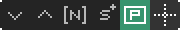
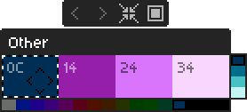
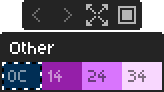
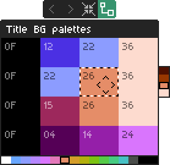
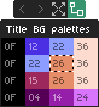

Open Source NES Art Editor

Beta 0.1.5


Edit NES graphics as the player sees them. No tile puzzle solving.

PPUX uses an in-app [database](#database) plus project files to understand banks, palettes, sprite layouts, animations, and other ROM-specific structures.

:information_source: If you wish to support the project, you can do so [here](https://tavuntu.itch.io/ppux).

- [Basic Usage](#basic-usage)
  - [Getting started](#getting-started)
  - [Windows system](#windows-system)
  - [Toolbars](#toolbars)
    - [App toolbar](#app-toolbar)
    - [CHR Banks toolbar](#chr-banks-toolbar)
    - [ROM Banks toolbar](#rom-banks-toolbar)
    - [Pattern table toolbar](#pattern-table-toolbar)
    - [Static Art (tiles and sprites) toolbar](#static-art-tiles-and-sprites-toolbar)
    - [Animation toolbar (for both sprites and tiles)](#animation-toolbar-for-both-sprites-and-tiles)
    - [OAM Animation toolbar](#oam-animation-toolbar)
    - [Global palette toolbar](#global-palette-toolbar)
    - [ROM palette toolbar](#rom-palette-toolbar)
    - [PPU Frame toolbar](#ppu-frame-toolbar)
  - [Palette windows](#palette-windows)
  - [Main controls](#main-controls)
  - [Tile mode](#tile-mode)
  - [Edit mode](#edit-mode)
  - [PNG drops](#png-drops)
- [Advanced](#advanced)
  - [Database](#database)
  - [DB contribution tracker](#db-contribution-tracker)
  - [Lua project mapping](#lua-project-mapping)
  - [PPU frame windows](#ppu-frame-windows)
  - [Byte budget for PPU Frame windows](#byte-budget-for-ppu-frame-windows)
  - [PPU frame editing notes](#ppu-frame-editing-notes)
  - [Current nametable codec coverage](#current-nametable-codec-coverage)
  - [OAM animation windows](#oam-animation-windows)
  - [ROM palette windows](#rom-palette-windows)
  - [Window references between entries](#window-references-between-entries)
  - [ROM patches](#rom-patches)
    - [1. Single byte (`address` + `value`)](#1-single-byte-address--value)
    - [2. Contiguous range (`addresses.from` / optional `addresses.to` + `values`)](#2-contiguous-range-addressesfrom--optional-addressesto--values)
    - [3. Address list (useful for non-contiguous values)](#3-address-list-useful-for-non-contiguous-values)
- [Development](#development)
  - [Build packages](#build-packages)
  - [Unit testing](#unit-testing)
  - [E2E testing](#e2e-testing)
- [Notes](#notes)
  - [Display resolution](#display-resolution)
  - [Canvas scale and filter](#canvas-scale-and-filter)
  - [Built with LÖVE](#built-with-löve)
  - [Custom `love.run` loop](#custom-loverun-loop)

## Basic Usage

### Getting started

Create a folder, place your ROM inside it, then drag the ROM into PPUX. After that, the app will either:

1. Open a default layout
2. Open a DB layout
3. Open a *.lua or *.ppux user project (if any)

NOTE: You can also open a project from the app toolbar or with `Ctrl + O`

If a ROM has no DB entry yet, it can still be used normally. DB entries are just curated starting points. That said, any user can "pick" a game and start working on a user project that can be used for a new DB entry Pull Request. [See this section](#db-contribution-tracker).

### Windows system

Windows are the main work areas in PPUX. Some are source windows, some are layout windows, and some are ROM-backed helper windows.

| Window                 | Taskbar icon                                                                                                             | Description                                                                                              |
| ---------------------- | ------------------------------------------------------------------------------------------------------------------------ | ---------------------------------------------------------------------------------------------------------|
| CHR Banks              |                       | Primary source window for normal CHR bank data                                                           |
| ROM Banks              |                       | Same as CHR Banks, but loads the whole ROM                                                               |
| Pattern table          |         | Sub-set of CHR/ROM items, intended to mimic the actual pattern tables assembled in game run-time |
| Static Art (tiles)     |        | Single-layer tile composition window for mockups and UI pieces                                           |
| Animation (tiles)      |                         | Tile animation window where each layer acts as a frame                                                   |
| Static Art (sprites)   |    | Single-layer sprite composition window with pixel-level placement                                        |
| Animation (sprites)    |                       | Sprite animation window for frame-by-frame sprite layouts                                                |
| OAM Animation          |                           | ROM-backed sprite animation; **requires a linked Pattern table** window for sprite CHR                                                    |
| Global palette         |              | Global palette window for items without an assigned ROM palette                                          |
| ROM palette            |             | ROM palette editor tied to ROM addresses                                                                 |
| PPU Frame              |                 | ROM-backed nametable and sprite view; It **also** requires pattern table links for rendering |


Notes:

* To be clearer on CHR vs ROM windows: CHR Banks is the normal source browser containing only graphics data.

* ROM Banks is the fallback source browser, useful for Games that use CHR RAM data (like Megaman 2, for instance) and, as mentioned above, it will load the whole ROM, so be careful on unintentional non-graphics pixel edits.

### Toolbars

#### App toolbar

The App toolbar sits at the top and hosts global quick actions; it also reserves space for status text on the right.


With no ROM loaded, only **Open project** appears on the strip. After a ROM or project workspace is loaded, quick buttons appear **left to right** in this order:

1. **New window** - opens the new window creation flow (`Ctrl + N`)
2. **Open project** - `Ctrl + O`
3. **Save options** - `Ctrl + S` (save / export flows)
4. **Copy** - copies the current selection (`Ctrl + C` in **tile mode** only; works on tile or sprite layers where clipboard is allowed; blocked on PPU Frame and OAM Animation sprite layers)
5. **Cut** - `Ctrl + X` (tile mode only for keyboard shortcuts)
6. **Paste** - `Ctrl + V` (tile mode only for keyboard shortcuts)
7. **Zoom out** - steps zoom on the **focused** window (palette windows and CRT lens windows are skipped); matches **Ctrl + wheel** down behavior
8. **Zoom in** - **Ctrl + wheel** up on the focused window
9. **Mirror X** - toggles horizontal mirror preview in the **focused** window (where supported; disabled for CRT lens windows). Shortcut: **`M`** (no modifiers). **CHR / ROM bank** and **pattern table** windows also use **`Ctrl + M`** for **8×8 vs 8×16 pair layout** (same cell size as CHR banks); see their toolbars below.
10. **Always on top** - toggles whether the **focused** window stays above others (disabled for CRT lens windows). Also available from the window’s title-bar menu.
11. **Add column to the right** - on grid-resizable layout windows only; hold **Shift** to switch the same control to **Remove last column** (tooltip updates)
12. **Add row below** - on grid-resizable layout windows only; **Shift** switches to **Remove last row**
13. **Clone focused window** - duplicate the current window’s kind and state where supported
14. **Reference PNG** - add or remove a reference image on eligible **layout** windows (not CHR/ROM banks or palette windows). **`Alt + R`** toggles visibility while a reference is attached; removing uses the button and a confirm dialog.

#### CHR Banks toolbar


1. **Previous bank** - `Left` key
2. **Next bank** - `Right` key
3. **Open base ROM folder** - opens your OS file manager on the folder that contains the loaded base ROM (disabled until PPUX knows a ROM path; tooltip explains *load ROM first* / *path unknown* states)
4. **Tile layout (8x8 / 8x16)** - straight `8x8` rows vs paired `8x16` layout - **`Ctrl + M`**. **`M`** alone toggles **Mirror X** (same as the app toolbar).
5. **Diff vs loaded CHR** - toggles “git-like” overlays on the bank canvas: compares current CHR tile bytes against the ROM’s CHR snapshot from when this session loaded (`D` shortcut with a CHR Banks window focused, no modifiers). When ON: **green** tint on tiles that changed, **dark** tint on unchanged tiles ([design detail](docs/ui/CHR_ROM_DIFF_MODE.md)).
6. **Sync duplicate tiles** - on: identical tiles edit together; off: independent cells

#### ROM Banks toolbar


Same strip as CHR Banks, excluding **Sync duplicate tiles** (a full-ROM surface makes that unsafe). Keyboard: **`Left`/`Right`** for banks, **`Ctrl + M`** for **tile layout**, **`M`** for **Mirror X**, **`D`** for **diff vs loaded CHR**.

#### Pattern table toolbar


1. **Tile layout (8×8 / 8×16)** - straight `8×8` rows vs paired `8×16` layout - **`Ctrl + M`** (same cell-size convention as CHR / ROM banks). Disabled when the pattern table has no active tile layer.
2. **Pattern table link (source)** - left-click for a menu: jump to linked consumer layer(s), or remove all links from this pattern table. Turns **green** when at least one consumer layer is linked.

Logical **ranges** are built by dragging tiles from **CHR Banks** or **ROM Banks** windows onto the pattern table canvas (not a toolbar button). Ranges must add up to **256** tiles for a complete map. Right-click a mapped cell for **Remove tile range at this tile**. Clipboard cut/paste is not available on pattern table windows.

#### Static Art (tiles and sprites) toolbar


1. **Palette link handle** - right-drag onto a **ROM palette** window, or from the ROM palette's handle onto this window. Left-click to link via a menu. Turns **green** when linked.

#### Animation toolbar (for both sprites and tiles)


1. **Previous layer** - `Shift` + `Down` key
2. **Next layer** - `Shift` + `Up` key
3. **Remove layer** - `-` key; refuses when only one frame remains (button stays visible)
4. **Add layer** - `+` key
5. **Copy from previous layer**
6. **Play / Pause** - `P` key (any case); layer switching is blocked while playing
7. **Palette link handle** - rightmost; same ROM palette linking behavior as [Static Art](#static-art-tiles-and-sprites-toolbar).


#### OAM Animation toolbar


1. **Previous layer** - `Shift` + `Down` key
2. **Next layer** - `Shift` + `Up` key
3. **Remove layer** - `-` key; refuses when only one frame remains (button stays visible)
4. **Add layer** - `+` key
5. **Add sprite** - visible when the active layer is a sprite layer
6. **Toggle origin guides** - toggles dotted reference lines (visible when a sprite layer exists and is active)
7. **Copy from previous layer**
8. **Play / Pause** - `P` key; layer switching is blocked while playing
9. **Pattern table link** - left-click for a menu to link or unlink a **Pattern table** window for **all frames** at once (**required** for sprite CHR). Turns **green** when every frame shares the same link.
10. **Palette link handle** - rightmost; same ROM palette linking behavior as [Static Art](#static-art-tiles-and-sprites-toolbar).

**Shift + right-drag** on the canvas moves sprite `originX` / `originY` (same as PPU Frame sprite layers).

#### Global palette toolbar


1. **Previous grouped slot** (when Grouped palettes is enabled)
2. **Next grouped slot** (when Grouped palettes is enabled)
3. **Compact / normal view**
4. **Set as active palette** - for painting where no ROM palette applies; if already active, clicking again does nothing. Use this before keyboard color editing on **global** palettes.

#### ROM palette toolbar


1. **Previous grouped slot** (when Grouped palettes is enabled)
2. **Next grouped slot** (when Grouped palettes is enabled)
3. **Compact / normal view**
4. **Palette link handle (source)** - right-drag to link layers onto destinations, or left-click for a menu. Turns **green** when linked layers are attached.

#### PPU Frame toolbar



1. **Previous layer** - `Shift` + `Down` key
2. **Next layer** - `Shift` + `Up` key
3. **Nametable range** - compressed nametable **start/end** ROM addresses
4. **Add sprite** - creates sprite layer if needed, otherwise adds a sprite
5. **Pattern table link** - left-click for a menu with separate **background** and **sprites** submenus to link **Pattern table** windows (**required** for nametable and sprite CHR). Turns **green** when at least one layer is linked. Tile/sprite layers consume the linked map; **ranges** are edited on the **Pattern table** window (see [Pattern table toolbar](#pattern-table-toolbar)), not here.
6. **Toggle origin guides** - hidden until a sprite layer exists; toggles dotted reference lines on sprite layers

### Palette windows

Palette windows are the palette editors/viewers used by the app.

There are 2 kinds:

* `Global palette`: the fallback palette for content that does not have a ROM palette linked to it. Use this for mockups, freeform art, and anything with no specific in-game palette assigned.
* `ROM palette`: a real 4x4 palette window backed by ROM data. It can be linked to specific windows and layers, to use the actual in-game palette through palette links.

In practice:

* If an item or layer has no ROM palette assigned, it uses a `Global palette`.
* If you want the colors to reflect actual game palette bytes, use a `ROM palette`.
* Only `ROM palette` windows are meant to be explicitly linked to other windows.
* Click a color to select it for editing/painting.
* In palette windows, arrow keys move the selected cell. For **global** palettes, set the palette as **active** (toolbar) before arrow/wheel color editing; **ROM** palettes do not require that step.
* `Shift + arrows`, mouse wheel, and `Shift + mouse wheel` adjust colors.

|                | Normal mode | Compact mode |
|----------------|-------------|--------------|
| Global palette |  |  |
| ROM palette    |  |  |

**Creating a link**

* Drag (right-drag) from a **ROM palette** window's connect handle and release over a destination window, **or**
* Drag from a **destination** window's connect handle (**Static Art**, **Animation** tiles/sprites, **OAM Animation**, etc.) and release over a **ROM palette** window, **or**
* Use left-click for contextual menus (**Link To Palette**, **Remove ROM palette link**, **Jump to linked palette**, etc.)

### Main controls

- `Ctrl + 1/2/3`: set **focused window** content zoom to 1×, 2×, or 3× (palette windows and collapsed headers skipped)
- `Ctrl + Page Up` / `Ctrl + Page Down`: cycle which **global** (**non-ROM**) palette is active - ROM palette windows are not cycled (same effect as “Set as active palette” on a global palette window; does not focus palette windows). When **Grouped palettes** is on, the grouped **global** slot (which palette is shown) stays in sync; needs at least two global palette windows
- `Ctrl + F`: toggle fullscreen
- `Ctrl + N`: open `New Window`
- `Ctrl + S`: open save options
- `Tab`: toggle `Tile` / `Edit` mode
- `Space`: toggle **mapping highlight** - when a non-CHR/ROM layout window is focused, highlights tiles or sprites in the active layer that match the tile indices in the **current CHR/ROM bank**; matching cells are also emphasized in CHR/ROM bank windows for the same bank. On **PPU Frame**, this works on the **sprite** layer only, not the nametable tile layer. Press `Space` again to turn it off.
- `Ctrl + G`: toggle the focused window grid
- `Ctrl + R`: toggle shader rendering for the focused layer
- `Ctrl + Z` / `Ctrl + Y`: undo / redo
- `Ctrl + C` / `Ctrl + X` / `Ctrl + V`: copy / cut / paste selection (**tile mode** only for keyboard shortcuts)
- In `ppu_frame` and `oam_animation` windows, clipboard actions are blocked **on sprite** layers
- `Right click` or `middle click` drag: move windows
- taskbar: focus, restore, and manage windows

### Tile mode


Tile mode is for selection, drag and drop and tile-level editing in general.

- Left click to select
- `Ctrl + click` or `Shift + drag` for multi-selection
- `Ctrl + A` to select all
- `Delete` / `Backspace` to remove selection where supported
- arrows to move tile selections among **occupied** cells
- `Shift + Up/Down` to switch layers in **multi-layer** windows (animations, PPU Frame, OAM Animation, etc.): **`Up` = next layer, `Down` = previous**. **Static Art** windows stay single-layer and do not use layer switching shortcuts.
- `Ctrl + Up/Down` to change inactive-layer opacity
- `1` to `4` to assign palette numbers to tiles/sprites where supported
- `H` / `V` to mirror selected sprites
- Bank windows: `Left/Right` switch banks, **`Ctrl + M`** toggles `8x8` / `8x16` layout, **`M`** toggles **Mirror X**, `D` toggles **diff vs loaded CHR** (`8x16` pairs highlight as one unit when either half differs)
- With a layout window focused, press **`Space`** to toggle cross-highlighting of matching tiles in the **current CHR/ROM bank** (see [Main controls](#main-controls)).

### Edit mode


Edit mode is for pixel-level editing.

- Left click to paint
- `Shift + click` draws a line from the last painted/clicked point
- `R` toggles the rectangle fill tool
- Hold `G` and left click or drag to grab a color
- Right-click also grabs the color under the cursor; **Alt + right-click** opens the menu shown in Tile mode
- Hold `F` and left click to flood fill
- `1` to `4` to choose the active color
- `Alt + 1/2/3/4` to change brush size presets
- `Ctrl + Alt + mouse wheel` also changes brush size
- `Ctrl + R` toggles shader rendering for the focused layer
- `Ctrl + G` toggles the focused window grid
- `Ctrl + Z` / `Ctrl + Y`: undo / redo

### PNG drops

You can drag and drop a PNG directly into PPUX. Requires a loaded ROM (or project workspace with ROM backing). The drop is always applied to the window **under the mouse**. If the pointer is not over any window, the **focused** window is used as the drop target instead.

Sprite PNG import (Static Art, Animation, OAM Animation, or **PPU Frame with the sprite layer active**):

* **Static Art**, **Animation**, and **OAM Animation**: a window qualifies if it has **any** sprite layer.
* **PPU Frame**: a window qualifies for sprite import only when the **active layer** is the **sprite** layer. If the active layer is the **tile** layer, the drop is **not** treated as a sprite import - even if a sprite overlay exists on another layer.
* If you have selected sprites, PPUX imports into those sprites in selection order.
* If no sprites are selected, PPUX imports into the layer's sprites from first to last.
* The PNG must use at most 4 total colors including transparency, or at most 3 non-transparent colors.
* The PNG dimensions must align to the current sprite mode: `8x8` sprites require multiples of `8x8`, and `8x16` sprites require multiples of `8x16`.
* The image is split into sprite-sized frames from left to right, top to bottom.
* Fully transparent frames are skipped.
* When importing into an unselected sprite layer, PPUX also repositions sprites to match the frame grid automatically.

PPU Frame windows (nametable unscramble):

* When the drop is **not** handled as sprite import (tile layer active on `ppu_frame`, or another window type), dropping on a **`ppu_frame`** window **under the mouse** runs the **nametable unscramble** flow for that screen: it matches the PNG against the current patterns in CHR/ROM and tries to build the nametable layout automatically. This is a powerful/time-saving piece of functionality but it's hard to explain exactly how it works, video tutorials will probably be more useful (soon to be made).

CHR and ROM bank windows:

* Dropping a PNG on a CHR-like window **under the mouse** imports the image into the selected tile position, or the top-left if nothing is selected.

Note: PNG drops aren't currently supported for tile layouts (except for the tiles in CHR/ROM Bank windows)

## Advanced

### Database

The DB lets PPUX recognize specific ROMs and open a tailored starting workspace automatically.

DB entries are matched by ROM SHA-1 and can define open windows, relevant CHR banks, palette windows, ROM-backed views, and the initial workspace arrangement. If no DB entry exists, PPUX falls back to a default layout. User projects (*.lua and *.ppux) take priority over DB defaults.

Coverage might change frequently; use the [DB contribution tracker](#db-contribution-tracker) for the current status and in-progress entries.

### DB contribution tracker

The [DB contribution tracker sheet](https://docs.google.com/spreadsheets/d/1uxwTMG9cmv7juRGnYeg7M8aFsWqMgMWwBduhdpviIm4/edit?gid=1408935396#gid=1408935396) is a shared place to track which games already have DB coverage, which ones are in progress, pending, etc.

Use it to coordinate contributions, avoid duplicate effort, and leave notes about the current status of a game-specific DB entry.

### Lua project mapping

Lua project files are plain Lua tables returned from `<rom>.lua`:

```lua
return {
  kind = "project",
  projectVersion = 1,
  currentBank = 1,
  focusedWindowId = "bank",
  edits = {},
  windows = {}
}
```

The most important fields are windows and edits. For windows, common fields include kind, id, title, x/y/z, zoom, workspace size, viewport size, scroll position, and layer state.

For edits, the data stores per-bank, per-tile pixel edits applied on top of the source ROM data, using a compact compressed format.

The recommended workflow is to save once from the UI, use the generated project (*.lua or *.ppux) as the template, then create windows, layouts, edits, etc, and keep the project growing as you wish (either for personal use, sharing or even for a new DB entry PR).

Notes:

* PPUX never overwrites the original ROM. Pixel edits and other byte changes (like patches, palette color changes, etc) are written as `<rom>_edited.nes`.

* Project files are saved either as `<rom>.lua` and `<rom>.ppux`.

* `*.ppux` files are just zlib-compressed versions of Lua project files, useful when you want smaller files or prefer not to keep the project contents easily readable.

Best practice: keep the base ROM, edited ROM, and project files in the same folder.

### PPU frame windows

`ppu_frame` windows are structured screen views: a **tile** layer backed by compressed nametable data in ROM, plus an optional **sprite** overlay that tracks real OAM bytes. Link **Pattern table** windows from the toolbar so the tile layer, sprite layer, or both can resolve CHR through shared **`patternTable.ranges`**. The same **Pattern table** window can be linked from multiple PPU frames or OAM animation windows.

Use **New Window > PPU Frame** and the in-app toolbars / context menus to edit nametables and sprites; saving the project persists layer state and nametable diffs.

### Byte budget for PPU Frame windows

PPU Frame tile layers support `noOverflowSupported = true`. This means the compressed nametable stream should stay within its original ROM byte budget.

Why it matters: some games leave safe free space after the stream, and some do not.

TMNT II is a good example of this: compressed byte ranges are packed tightly, so PPUX reads one nametable from a defined range while the next nametable begins immediately after it:


Contra (J) example, where the byte "buffer" has plenty of space:


PPUX warns when the compressed stream goes over budget and clears the warning if it returns to a valid size.

### PPU frame editing notes

* **Empty nametable cells** use nametable byte **0** by default, which resolves to pattern-table **tile 0** through the **linked Pattern table** window's **`patternTable.ranges`** (each range contributes bank, page, and tile index span).
* Tile layers render from a **cached full-canvas** nametable view for performance; after heavy edits, use the normal refresh paths the UI offers if a screen looks stale.
* For **sprites**, use **Add sprite** on the toolbar to bind OAM entries. Sprite items that share the same `startAddr` **stay in sync** with **OAM Animation** windows (and other PPU Frame sprite layers) so moving or reconfiguring one updates the linked entries.
* **Nametable range sync:** PPU Frame windows that share the same `nametableStartAddr` and `nametableEndAddr` keep their uncompressed nametable + attribute bytes (and ROM slice) aligned when you edit the tile layer in any one of them - similar to sprite `startAddr` sync.
* **Sprite layer origin**: hold **Shift** and **drag with the right mouse button** on the frame to slide `originX` / `originY` (values clamp to the PPU range). Use the **origin guides** toggle on the toolbar for dotted reference lines. When you are not dragging, **right-click** behaves like elsewhere (in **edit mode** over paintable pixels, **Alt + right-click** opens the menu if you want the menu instead of sampling a color - see [Edit mode](#edit-mode)).
* **Pattern table ranges** live on the linked **Pattern table** window (drag tiles from **CHR Banks** / **ROM Banks** onto the pattern table canvas; see [Pattern table toolbar](#pattern-table-toolbar)). After editing ranges there, the PPU frame picks up the shared map through its link.

**Project file sketch** (what the UI ultimately saves) - useful when diffing projects or contributing DB entries:

```lua
{
  kind = "ppu_frame",
  id = "ppu_01",
  layers = {
    [1] = {
      kind = "tile",
      linkedPatternTableWindowId = "pattern_table_01",
      -- legacy: `patternTable = { ranges = {...} }` inlined on the layer
      nametableEndAddr = 0x01329B,
      nametableStartAddr = 0x013110,
      paletteData = { winId = "rom_palette_01" }
    },  
    [2] = {
      kind = "sprite",
      linkedPatternTableWindowId = "pattern_table_02",
      mode = "8x16",
      items = {
        { startAddr = 0x009F2B },  -- optional legacy: bank, tile
        ...
      }
    },
  }
}
```

In tile layers, `nametableStartAddr` and `nametableEndAddr` define the ROM byte range used for the nametable data handled by that window (it's the same bytes read by an emulator when loading a specific nametable). The app reads from that range when loading the screen data, and writes back into the same range when saving changes. CHR **bank/page** indexing for nametable tiles comes from the linked **`pattern_table`** window (**`linkedPatternTableWindowId`**, its **`patternTable.ranges`**); inlined **`patternTable`** on the tile layer remains for legacy saves.

For sprite layers, `startAddr` is the most important field because it links the item to the 4 OAM bytes in ROM. The app uses byte 1 for Y position, byte 3 for attributes/palette/mirroring, and byte 4 for X position directly through the app UI. Byte 2 is the tile byte in ROM; the editor resolves visible CHR using the layer's **`linkedPatternTableWindowId`** (same idea as OAM). Optional **`bank` and `tile`** on each sprite item can still appear in saved projects for legacy or display resolution.

### Current nametable codec coverage

PPUX currently includes one nametable codec implementation aimed at Konami-style streams (konami.lua). New codecs for different games/styles will be added as the app development progresses.

### OAM animation windows

`oam_animation` windows are ROM-backed sprite animations: **each layer is one hardware frame** of sprites tied to real OAM bytes. Like PPU frames, they **require** a linked **Pattern table** window for sprite CHR; multiple animation or PPU windows can share the same pattern table.

**Creating and editing from the UI**

1. Open **New Window** and choose **OAM Animation**.
2. Link a **Pattern table** window from the toolbar (**required** for sprite CHR), then use **Add sprite** and the frame/layer controls to build each frame. **OAM start address** is set in the add-sprite modal; CHR comes from the linked pattern table (no per-sprite bank/tile fields in the modal).
3. Frames can be **played** from the toolbar like other animation windows; layer **switching** (`Shift+Up/Down`, toolbar prev/next) is blocked during playback.
4. Items that share a `startAddr` **sync** with **PPU Frame** sprite layers (and other OAM windows) so OAM edits stay consistent everywhere that references the same bytes.
5. **Origin** and **origin guides** behave like PPU Frame sprite layers: **Shift + right-click drag** moves `originX` / `originY`; the dotted-line button toggles guides.

**Project file sketch:**

```lua
{
  kind = "oam_animation",
  id = "oam_animation_01",
  layers = {
    [1] = {
      kind = "sprite",
      linkedPatternTableWindowId = "pattern_table_oam_01",
      mode = "8x16",
      items = {
        { startAddr = 0x0095FA },
        ...
      }
    },
    ...
  }
}
```

Important fields are frame timing (`delaysPerLayer`), sprite frames (`layers`), local origin, palette source, and ROM-backed `startAddr` entries.

### ROM palette windows

`rom_palette` windows are `4x4` palette editors backed directly by ROM addresses.

Use the **connect button** on the ROM palette toolbar to right-drag links onto layers, and **left-click** it for source-side management (**Jump to linked layer**, **Remove all links**). Turns **green** when linked. Toggle **compact mode** from the same toolbar when you want a denser view. Destination windows still use their own connect handle plus the contextual **Link To Palette** / **Remove ROM palette link** entries documented in [Palette windows](#palette-windows).

Example:

```lua
{
  kind = "rom_palette",
  paletteData = {
    romColors = {
      [1] = { 0x01F688, 0x0112ED, 0x0112EE, 0x0112EF },
      [2] = { 0x01F688, 0x0112F0, 0x0112F1, 0x0112F2 },
      [3] = { 0x01F688, 0x0112ED, 0x0112EE, 0x011243 },
      [4] = { 0x01F688, 0x0112F0, 0x0112F1, 0x011252 },
    }
  }
}
```

So each `romColors[row][col]` stores a ROM address for a given palette color. The first column is the universal background color, usually one single "shared" ROM address. On cells that are not directly editable, **double-click** opens the ROM address assignment flow described in the in-app status hint.

### Window references between entries

Some windows refer to other windows by `id`, for example:

```lua
paletteData = {
  winId = "rom_palette_02"
}
```

The referenced window should exist elsewhere in the same `windows` array for correct palette resolution; missing IDs may fall back to inline palette data in legacy projects.

### ROM patches

PPUX can apply small ROM patches from project data before windows are built (so the user is already working on top of "patched" ROM).

This is meant for targeted graphics-related setup such as forcing a game state or changing a small byte sequence. It is not a replacement for a full ROM hacking workflow.

Patches live on the project table as an array, `romPatches`. Each entry must include a **`reason`** string (non-empty description). Every value written is a **single byte** (0-255). Addresses are **unsigned integers** (0 or positive).

Use one of 3 different forms:

#### 1. Single byte (`address` + `value`)

One ROM address, one new byte.

```lua
{
  address = 0x009A36,
  reason = "Indoors, idle pose, change tile index in right leg",
  value = 0x70
}
```

#### 2. Contiguous range (`addresses.from` / optional `addresses.to` + `values`)

If `addresses.to` is omitted, it is derived from `addresses.from` and the number of entries in `values` (`to = from + #values - 1`). If you include `to`, the inclusive byte count must match `#values` (i.e. `to = from + #values - 1`).

```lua
{
  addresses = {
    from = 0x01F626,
    to = 0x01F62D
  },
  reason = "Change blinking letters in title screen (Player 1)",
  values = {
    0xCA, 0xFA, 0x00, 0x00, 0x00, 0x00, 0x00, 0x00
  }
}
```

#### 3. Address list (useful for non-contiguous values)

`addresses[1]` gets `values[1]`, `addresses[2]` gets `values[2]`, etc. The two lists must have the same length. Addresses do not need to be consecutive.

```lua
{
  addresses = {
    0x009A71,
    0x009A7B,
    0x009B00
  },
  reason = "Prepare sprite for 'on-the-ground' indoor sprites",
  values = {
    0x05,
    0x8A,
    0x00
  }
}
```

## Development

### Build packages

To build a packaged Windows app from Windows, run:

```bat
scripts\windows\build_windows.bat
```

The packaged Windows app will be created only as `build\PPUX-<version>-win64.zip`.

To build a packaged Linux app from Linux, run:

```bash
./scripts/unix/build_linux_appimage.sh
```

The packaged Linux app will be created as `build/PPUX-<version>-x86_64.AppImage`.

You can also build for Windows and macOS from Linux using `./scripts/unix/build_all.sh` (macOS build not tested yet).

### Unit testing

PPUX includes a unit test suite.

From repo root:

```bash
./scripts/unix/run_unit_tests.sh
```

On Windows:

```bat
scripts\windows\run_unit_tests.bat
```

See [Unit Testing](docs/test/UNIT_TESTING.md) for details and alternatives.

### E2E testing

PPUX also includes visible end-to-end test scenarios that boot the real app.

Run full suite:

```bash
./scripts/unix/run_e2e_tests.sh
```

On Windows:

```bat
scripts\windows\run_e2e_tests.bat
```

Run a single scenario:

```bash
./scripts/unix/run_e2e_demo.sh modals
```

See [E2E Testing](docs/test/E2E_TESTING.md) for scenario details and options.

:white_check_mark: All 794 unit tests passing.

:white_check_mark: All 24 E2E tests passing.

## Notes

### Display resolution

The entire UI is rendered to a **640×360** canvas (16:9). That base size is deliberate: it scales to common monitor resolutions with **integer pixel multiples** and no fuzzy fractional upscaling:

- **2×** — 720p (1280×720)
- **3×** — 1080p (1920×1080)
- **4×** — 1440p (2560×1440)
- **6×** — 4K (3840×2160)

Every UI pixel stays crisp when the OS window is sized to those integer multiples. Resize the window freely; use **Settings → Appearance → Canvas scale** to control how the 640×360 workspace fits the monitor (see below). Use **`Ctrl + 1/2/3`** to set **focused window** content zoom (1×, 2×, 3×), not canvas presentation scale.

### Canvas scale and filter

Open **Settings** from the taskbar menu (**Appearance** tab) to control how the 640×360 workspace is presented on screen. These options persist across sessions.

**Canvas scale** — how the workspace fits the OS window:

- **Keep aspect** — scale uniformly to fill the window while preserving 16:9 (default)
- **Pixel-perfect** — integer scaling only; may letterbox, but keeps UI pixels sharp
- **Stretch** — fill the window on both axes; can distort if the window is not 16:9

**Canvas filter** — how scaled pixels are sampled:

- **Sharp** — nearest-neighbor filtering for crisp pixels (default)
- **Soft** — linear filtering for a smoother upscale
- **CRT** — barrel distortion and scanlines over the workspace (works best at 1080p and higher)

Other **Appearance** options:

- **Window links** — when to show on-canvas ROM palette / pattern-table link lines and left-edge pivot handles (`never`, `on_hover`, `always`, `auto_hide`)
- **Separate toolbar** — detach specialized toolbars from window headers

### Built with LÖVE

PPUX is built with [LÖVE](https://love2d.org/) 11.5, the open-source 2D framework for Lua. Rendering, input, windowing, and the custom UI all run on top of it.

### Custom `love.run` loop

Instead of LÖVE's default main loop, PPUX uses a custom `love.run` implementation. It keeps the familiar update/draw flow, but can run with lower latency during interactive frames (e.g., when the user is dragging the brush), where per-frame mouse polling and tighter frame pacing make strokes feel more responsive. When that mode is off, the loop falls back to calmer pacing closer to stock LÖVE behavior.
