NES/Famicom Graphics Studio. Mod classic games or build new Homebrew assets.

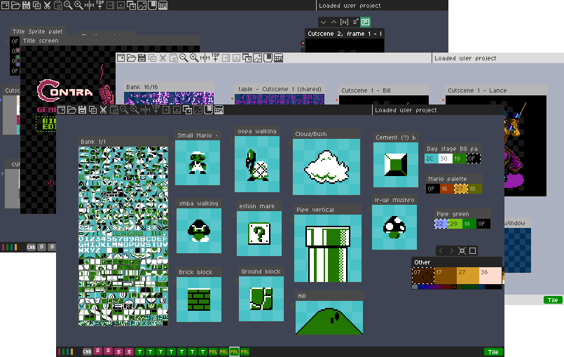

-6366F1?style=flat)
[](https://ko-fi.com/tavuntu)

Edit graphics in game-context (as the player sees them), no tile puzzle solving.

PPUX uses an in-app [database](#database) plus project files to understand banks, palettes, sprite layouts, animations, and other ROM-specific structures.

- [Basic Usage](#basic-usage)
  - [Getting started](#getting-started)
  - [Windows system](#windows-system)
  - [Toolbars](#toolbars)
  - [Palette windows](#palette-windows)
  - [Main controls](#main-controls)
  - [Tile mode](#tile-mode)
  - [Edit mode](#edit-mode)
  - [PNG drops](#png-drops)
- [Advanced](#advanced)
  - [Database](#database)
  - [Lua project mapping](#lua-project-mapping)
  - [Sketch canvas & Gallery ROM](#sketch-canvas--gallery-rom)
  - [PPU frame & OAM](#ppu-frame--oam)
  - [ROM palette & patches](#rom-palette--patches)
- [Development](#development)
- [Notes](#notes)

## Basic Usage

### Getting started

PPUX has two main functionalities:

1. Modify graphics on an existing game.
2. Create graphics from scratch.

For the first approach, drop a ROM into the window. Without a DB entry, PPUX loads a basic default layout. With one, it opens a tailored workspace: the core strength of the tool.

For the second approach, use _Sketch Canvas_ windows. From these you can generate pattern tables and map colors through attributes, as with real nametables. You can export CHR and nametable binaries, or a full _Gallery ROM_ with one gallery item per Sketch Canvas.

### Windows system

Windows are the main work areas in PPUX. Some are source windows, some are layout windows, and some are ROM-backed helper windows.

| Window        | Taskbar icon                                                                                                        | Description                                                                                                                                                    |
| ---------------------- | ------------------------------------------------------------------------------------------------------------------------ | -------------------------------------------------------------------------------------------------------------------------------------------------|
| CHR Banks              |                       | Primary source window for CHR                                                                                                                    |
| ROM Banks              |                       | Same as CHR Banks, but loads the whole ROM                                                                                                       |
| Static Art (tiles)     |        | Single-layer, grid-snapped tile assembly                                                                                                         |
| Animation (tiles)      |       | Multi-layer, grid-snapped tile assembly                                                                                                          |
| Static Art (sprites)   |    | Single-layer sprite composition, items are pixel-snapped                                                                                         |
| Animation (sprites)    |   | Multi-layer sprite composition, items are pixel-snapped                                                                                          |
| OAM Animation          |          | ROM-backed sprite animation, **requires a linked Pattern table** window for sprite CHR. Each sprite is created from a real ROM address (OAM)     |
| Global palette         | 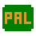             | Global palette window for items without an assigned ROM palette (cycle them with PgUp/PgDown)                                                    |
| ROM palette            |             | ROM palette editor: **ROM** role (addresses) or **Sketch** role (free 4x4 for sketch canvases)                                                   |
| PPU Frame              |                 | ROM-backed nametable and sprite view. It **also** requires pattern table links for rendering                                                     |
| Pattern table          |         | Sub-set of CHR/ROM items, intended to mimic the actual pattern tables assembled in game run-time                                                 |
| Sketch canvas          |              | Free 256x240 background paint canvas. It packs into its own **Pattern table**. See [Sketch canvas & Gallery ROM](#sketch-canvas--gallery-rom)    |

You'll also notice these little "handles" on windows:


When colored, they indicate the window has a link to another one. In order they are:

1. Background/nametable pattern table (red)
2. Sprite-layer pattern table (green)
3. ROM palette (blue)
4. Pattern table linked to both BG and sprite layers (brown)

Click a colored handle to bring the linked window forward and focus it. Handles aren’t drag targets. To add/change/remove links, use the toolbars _Pattern table link_ and _ROM Palette link_ buttons.


### Toolbars

<table>
<tbody>
<tr>
<td>

**App toolbar**

The App toolbar sits at the top and hosts global quick actions. It also reserves space for status text on the right.


1. **New window** - opens the new window creation flow (`Ctrl + N`).
2. **Open project** - `Ctrl + O`.
3. **Save options** - `Ctrl + S` (save / export flows).
4. **Copy** - copies the current selection (`Ctrl + C` in **tile mode** only). Works on tile or sprite layers where clipboard is allowed. Blocked on PPU Frame and OAM Animation sprite layers.
5. **Cut** - `Ctrl + X` (for now, tile mode only).
6. **Paste** - `Ctrl + V` (for now, tile mode only).
7. **Zoom out** - zooms out the focused window.
8. **Zoom in** - zooms in the focused window.
9. **Mirror X** - toggles horizontal mirror preview in the **focused** window. Shortcut: **`M`**.
10. **Always on top** - toggles whether the **focused** window stays above others. Also available from the window's title-bar menu.
11. **Add column to the right** - on grid-resizable layout windows only. Hold **Shift** to switch the same control to **Remove last column** (tooltip updates).
12. **Add row below** - Same as the previous one, but for rows.
13. **Clone focused window** - duplicate the current window's kind and state where supported.
14. **Reference PNG** - add or remove a reference image on eligible **layout** windows. **`Alt + R`** toggles visibility while a reference is attached.
15. **Generate gallery ROM** - builds an interactive `.nes` gallery ROM from packed **Sketch canvas** windows (see [Sketch canvas & Gallery ROM](#sketch-canvas--gallery-rom)).
16. **Relocation pointer calculator** - helper for nametable **`relocateTo`** workflows: turns a ROM file offset into little-endian pointer bytes for `romPatches` (see [PPU frame & OAM](#ppu-frame--oam)).

</td>
</tr>
<tr>
<td>

**CHR Banks toolbar**

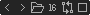

1. **Previous bank** - `Left` key.
2. **Next bank** - `Right` key.
3. **Open base ROM folder** - opens your OS file manager on the folder that contains the loaded base ROM.
4. **Tile layout (8x8 / 8x16)** - straight `8x8` rows vs paired `8x16` layout - **`Ctrl + M`**.
5. **Diff vs loaded CHR** - toggles "git-like" overlays on the bank canvas: compares current CHR tile bytes against the original ROM bytes. Shortcut: D.
6. **Sync duplicate tiles** - ON: identical tiles edit together. OFF: independent cells.

</td>
</tr>
<tr>
<td>

**ROM Banks toolbar**

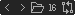

Same strip as CHR Banks, excluding **Sync duplicate tiles** (a full-ROM surface makes that unsafe).

</td>
</tr>
<tr>
<td>

<a id="static-art-tiles-and-sprites-toolbar"></a>**Static Art (tiles and sprites) toolbar**


1. **Palette link handle** - right-drag onto a **ROM palette** window, or from the ROM palette's handle onto this window. Left-click to link via a menu.

</td>
</tr>
<tr>
<td>

**Animation toolbar (for both sprites and tiles)**


1. **Previous layer** - `Shift` + `Down` key.
2. **Next layer** - `Shift` + `Up` key.
3. **Remove layer** - `-` key. Refuses when only one frame remains (button stays visible).
4. **Add layer** - `+` key.
5. **Copy from previous layer** - Copies everything, including palette links to individual items.
6. **Play / Pause** - `P` key, layer switching is blocked while playing.
7. **Frame delay** - `Shift` + `Left` or `Shift` + `Right` adjusts delay for all frames. Status bar shows the current value.
8. **Palette link handle** - Same ROM palette linking behavior as [Static Art](#static-art-tiles-and-sprites-toolbar).

</td>
</tr>
<tr>
<td>

**OAM Animation toolbar**


1. **Previous layer** - `Shift` + `Down` key.
2. **Next layer** - `Shift` + `Up` key.
3. **Remove layer** - `-` key, refuses when only one frame remains.
4. **Add layer** - `+` key.
5. **Add sprite** - visible when the active layer is a sprite layer.
6. **Toggle origin guides** - toggles dotted reference lines, this is user defined, not something that comes from ROM data.
7. **Copy from previous layer** - Copies everything, including palette links to individual items.
8. **Play / Pause** - `P` key, layer switching is blocked while playing.
9. **Frame delay** - `Shift` + `Left` / `Shift` + `Right` adjusts delay for all frames. Status bar shows the current value.
10. **Pattern table link** - left-click for a menu to link or unlink a **Pattern table** window for **all frames** at once (**required** for sprite CHR).
11. **Palette link handle** - Same ROM palette linking behavior as [Static Art](#static-art-tiles-and-sprites-toolbar).

**Shift + right-drag** on the canvas moves sprite `originX` / `originY` (same as PPU Frame sprite layers).

</td>
</tr>
<tr>
<td>

**Global palette toolbar**

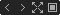

1. **Previous grouped slot** (when Grouped palettes is enabled).
2. **Next grouped slot** (when Grouped palettes is enabled).
3. **Compact / normal view** - Changes the window's size, basically.
4. **Set as active palette** - for painting where no ROM palette applies (when there are multiple global palettes, use PgUp/PgDown to cycle through them).

</td>
</tr>
<tr>
<td>

**ROM palette toolbar**


1. **Previous grouped slot** (when Grouped palettes is enabled).
2. **Next grouped slot** (when Grouped palettes is enabled).
3. **Compact / normal view** - Changes the window's size, basically.
4. **Palette link handle (source)** - right-drag to link layers onto destinations, or left-click for a menu.

</td>
</tr>
<tr>
<td>

**PPU Frame toolbar**


1. **Previous layer** - `Shift` + `Down` key.
2. **Next layer** - `Shift` + `Up` key.
3. **Nametable range** - Set compressed nametable **start/end** ROM addresses (the range/stream of bytes used to build a given pattern table).
4. **Add sprite** - Adds a sprite (creates a sprite layer first, if there is none).
5. **Pattern table link** - left-click for a menu with separate **background** and **sprites** submenus to link **Pattern table** windows (**required** for nametable and sprite CHR).
6. **Toggle origin guides** - hidden until a sprite layer exists, it toggles dotted reference lines on sprite layers.

</td>
</tr>
<tr>
<td>

**Pattern table toolbar**


1. **Tile layout (8x8 / 8x16)** - straight `8x8` rows vs paired `8x16` layout - **`Ctrl + M`**.
2. **Pattern table link (source)** - left-click for a menu: jump to linked consumer layer(s), or remove all links from this pattern table.

Logical **ranges** are built by dragging tiles from **CHR Banks** or **ROM Banks** onto the pattern table canvas. Ranges must add up to **256** tiles for a complete map. When a **Sketch canvas** owns the pattern table, CHR/ROM drops are blocked and the catalog comes from Generate.

</td>
</tr>
<tr>
<td>

**Sketch canvas toolbar**


1. **Tolerance (- / value / +)** - pixel-diff grouping for Generate (0-32). When linked, changing tolerance live-regenerates the pattern table.
2. **Generate** - packs the paint canvas into up to 256 unique patterns and applies them to the linked pattern table. If none is linked, offers to create one named from the sketch. Highlights when pixels changed since the last pack.
3. **Export CHR** - writes a 4KB CHR bank (256 tiles) beside the project/ROM folder (needs a successful Generate).
4. **Export nametable** - writes a 1024-byte `.nam` (960 tiles + 64 attribute bytes).
5. **Pattern table link** - left-click to link, jump to, or unlink a **Pattern table**.
6. **Palette link handle** - right-drag onto a **sketch-mode** ROM palette (or left-click for a menu). Turns **green** when linked. Needed for live multi-palette preview and Gallery ROM colors.

</td>
</tr>
</tbody>
</table>

### Palette windows

Palette windows are the editors used for colors across the app.

* **Global palette** - the fallback palette when nothing has a ROM palette linked. Handy for mockups and freeform art.
* **ROM palette** (`4x4`) - when you create one, PPUX asks for a **role**: **ROM** (backed by ROM addresses for in-game palette editing) or **Sketch** (free colors, only for Sketch canvas windows).

|                | Normal mode | Compact mode |
|----------------|-------------|--------------|
| Global palette | 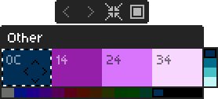 | 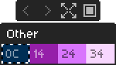 |
| ROM palette    | 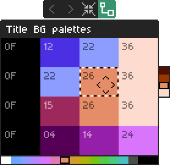 | 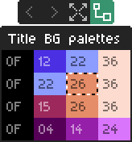 |

To create a link, right-drag from a connect handle on either the palette or the destination window, or use the left-click menus (**Link To Palette**, **Remove ROM palette link**, **Jump to linked palette**, and so on). Sketch canvases only accept **sketch-mode** palettes. Other layout windows use **ROM**-role palettes.

Linked ROM palette and pattern-table windows also show small squares on the left edge of the window chrome (or below, if collapsed). Hover shows the link lines (depending on **Settings > Appearance > Window links**). Click a connected square to focus and raise the linked window(s).

### Main controls

- `Ctrl + 1/2/3`: set the app window to 1x, 2x, or 3x integer scale of the 640x360 canvas (for example 1280x720 or 1920x1080).
- `Page Up` / `Page Down`: cycle which **global** (non-ROM) palette is active. ROM palette windows are not part of this cycle.
- `Ctrl + F`: toggle fullscreen.
- `Ctrl + N`: open New Window.
- `Ctrl + S`: open save options.
- `Tab`: toggle between Tile and Edit mode.
- `Space`: highlight all sprites on the active sprite layer.
- `Ctrl + G`: cycle through different layer grids (PPU Frame and Sketch canvas include the attribute-region grid).
- `Ctrl + R`: toggle shader coloring on the focused layer (on by default). When off, pixels show gray values matching color codes 0-3.
- Right-click or middle-click drag to move windows. Use the taskbar to focus, restore, and manage them.

### Tile mode

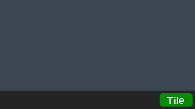

Tile mode is for selection, drag/drop, and tile-level editing in general.

- Left click to select. `Ctrl + click` or `Shift + drag` for multi-selection. `Ctrl + A` selects all.
- `Delete` / `Backspace` removes the selection where supported.
- Arrow keys move tile selections among occupied cells.
- `Shift + Up/Down` switches layers in multi-layer windows (animations, PPU Frame, OAM Animation, and so on). Static Art stays single-layer.
- `1` to `4` assign palette numbers to selected tiles or sprites where supported.
- `H` / `V` mirror selected sprites on a sprite layer.
- On bank windows, `Left/Right` switch banks, `Ctrl + M` toggles 8x8 / 8x16 layout, `M` toggles Mirror X, and `D` toggles diff vs loaded CHR.

### Edit mode

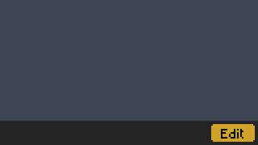

Edit mode is for pixel-level painting.

- Left click to paint. `Shift + click` draws a line from the last painted point. `Shift + drag` fills a rectangle.
- Hold `G` and left click (or just right-click) to sample a color.
- Hold `F` and left click to flood fill.
- `1` to `4` choose the active color. `Alt + 1/2/3/4` or `Ctrl + Alt + mouse wheel` change brush size.
- On a **Sketch canvas**: hold `C` and left-click to mask all pixels of the clicked color. Hold `C` and right-click to clear the mask. `S` toggles region select (rectangular selection, unless Shift is used before the click).

### PNG drops

You can drag and drop a PNG onto the window under the mouse (or the focused window if the pointer is not over any window). Two import paths are supported:

**OAM sprite layers** (**OAM Animation**, or a **PPU Frame** with the **sprite** layer active):

* At most 4 colors, and one may be fully transparent. Transparent pixels become NES palette index 0 (BG). BG stand-in defaults to black. If that black is already an opaque color, BG falls back to brown so opaque black stays visible. With no alpha, the darkest opaque color is BG instead.
* Dimensions must match the sprite mode: multiples of `8x8` or `8x16`.
* Frames are read left to right, top to bottom. Fully transparent frames are skipped.
* Selected sprites are filled in selection order. With no selection, sprites are filled from first to last.

**Sketch canvas** (edit or tile mode):

* Drop a **256x240** PNG to write the paint buffer and pack it into the **linked Pattern table** (256-slot catalog, same as Generate).
* A linked Pattern table is required. If the pack or Pattern table is already filled, PPUX asks to confirm replace-all.
* Packing uses tolerance 0 so tile mode matches the PNG. More than 256 unique patterns fails.

## Advanced

### Database

The DB lets PPUX recognize specific ROMs and open a tailored starting workspace automatically.

Entries are matched by ROM SHA-1 and can define which windows open, which CHR banks matter, palette windows, ROM-backed views, and the initial arrangement. If no DB entry exists, PPUX falls back to a default layout. User projects (`*.lua` and `*.ppux`) take priority over DB defaults.

Coverage changes often. Use the [DB contribution tracker sheet](https://docs.google.com/spreadsheets/d/1uxwTMG9cmv7juRGnYeg7M8aFsWqMgMWwBduhdpviIm4/edit?gid=1408935396#gid=1408935396) to see what is done, in progress, or pending, and to coordinate contributions without duplicating work.

### Lua project mapping

Lua project files are plain Lua tables returned from `<rom>.lua` (or the zlib-compressed `*.ppux` equivalent). The important fields are usually `windows` and `edits`: window layout and state on one side, and per-bank / per-tile pixel edits on the other.

The recommended workflow is to save once from the UI, then use the generated project as a template. Keep adding windows, layouts, and edits from there, whether for personal use, sharing, or a future DB entry PR.

Notes:

* PPUX never overwrites the original ROM. Pixel edits and other byte changes (patches, palette colors, and so on) go into `<rom>_edited.nes`.
* `<rom>` is the base ROM file name. It can contain spaces and dots.
* Best practice: keep the base ROM, edited ROM, and project files in the same folder.

### Sketch canvas & Gallery ROM

Sketch canvases are for creating NES background art from scratch. You paint on a free 256x240 buffer (32x30 tiles of 8x8), then pack that paint into a real nametable plus pattern table catalog. You can also drop a 256x240 PNG onto the sketch to pack it in one step (see [PNG drops](#png-drops)).

Note: some of the pixel tools available on Sketch canvas are not fully available on other window kinds yet. The UI still needs polish too (toolbar icons, binary save flow, and so on).

| Mode | After Generate | Behavior |
| --- | --- | --- |
| **Edit** | Free paint | Pixel brush, fill, select, color mask. Paint is the source of truth |
| **Tile** | Packed view | Screen is composed from the linked nametable tile pool. Painting is blocked. You can select tiles, rearrange them, remove them, and change attributes (keys 1-4) |

After Generate, the sketch toolbar can export a 4KB CHR bank and a 1024-byte nametable (`.nam`) next to the project or ROM folder.

**Generate gallery ROM** on the app toolbar (NES cartridge icon) builds a CNROM gallery `.nes` from every packed sketch canvas in window order (up to 16 slides). PPUX writes CHR / nametable / palette binaries, assembles with **ca65/ld65** (cc65), and saves `<rom>_gallery.nes` beside your project or ROM. Each slide uses its linked sketch palette (or a default brown ramp) plus the sketch attribute table.

### PPU frame & OAM

`ppu_frame` windows are structured screen views: a **tile** layer backed by compressed nametable data in the ROM, plus an optional **sprite** overlay that tracks real OAM bytes. Link **Pattern table** windows from the toolbar so the tile layer, sprite layer, or both can resolve CHR through shared pattern-table ranges. The same Pattern table can be linked from multiple PPU frames or OAM animation windows.

Use **New Window > PPU Frame** and the toolbar / right-click menus to edit nametables and sprites. Saving the project keeps layer state and nametable diffs.

When a compressed nametable may grow past its original ROM range, set **`relocateTo`** on the nametable layer so PPUX writes the stream to a new file offset, then patch the game's read pointer with `romPatches`. The app toolbar **Relocation pointer calculator** turns a `relocateTo` file offset into the little-endian `lo` / `hi` bytes for that patch. You still need to find the original table pointers in the ROM yourself. In short: if there is empty space that can hold the nametable (with room to spare), you can move the stream there and retarget the game to read it. This is advanced and may be clearer in a video tutorial later.

**Byte budget** (`noOverflowSupported = true`) means the compressed stream should stay within its original ROM range. Some games leave safe free space after a stream. Others pack the next nametable immediately after the previous one.

TMNT II is a tight example: one nametable ends and the next begins right away:

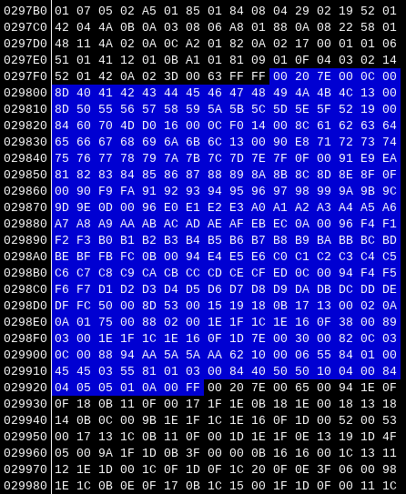

Contra (J) has more headroom after the stream:

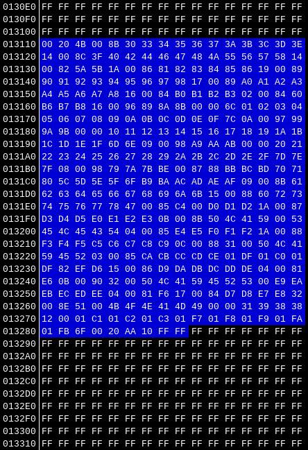

PPUX warns when the compressed stream goes over budget, and clears the warning if it fits again. Some games have both situations depending on the screen.

Nametable codecs today cover Konami-style streams (`konami.lua`) and Zelda II PPU macro streams (`zelda2.lua`). More codecs and DB entries will land as development continues.

`oam_animation` windows are ROM-backed sprite animations where **each layer is one hardware frame** of sprites tied to real OAM bytes. Like PPU frames, they need a linked **Pattern table** for sprite CHR. Multiple animation or PPU windows can share the same pattern table.

From the UI: open **New Window > OAM Animation**, link a Pattern table, then use **Add sprite** and the frame controls to build each frame. The add-sprite modal sets the OAM start address. CHR comes from the linked pattern table. Playback works like other animation windows. Items that share a `startAddr` stay in sync with PPU Frame sprite layers (and other OAM windows). Origin and origin guides behave the same way as on PPU Frame sprite layers (`Shift + right-drag` moves `originX` / `originY`).

### ROM palette & patches

`rom_palette` windows are `4x4` palette editors. **ROM**-role windows are backed by ROM addresses. **Sketch**-role windows hold free colors for Sketch canvas.

On the ROM palette toolbar, use the connect button to right-drag links onto layers, or left-click it for source-side management (**Jump to linked layer**, **Remove all links**). Compact mode lives on the same toolbar. Destination windows still use their own connect handle and the Link / Remove / Jump menu entries described under [Palette windows](#palette-windows).

For ROM-role data, each `romColors[row][col]` stores a ROM address for that palette color. The first column is usually the shared universal background color. Double-click a cell to open the ROM address assignment flow. Sketch-role windows skip that double-click, since their colors are not tied to ROM addresses.

Other windows can point at a palette by `winId` instead of repeating hex addresses:

```lua
paletteData = {
  winId = "rom_palette_02"
}
```

The referenced window must also appear in the same `windows` array so palette resolution works. Pointing several windows at one `rom_palette` entry is how you share palette data without pasting the same hex over and over.

`romPatches` apply small ROM patches from project data before windows are built, so you are already working on top of a patched ROM. This is for targeted graphics-related setup (force a game state, tweak a short byte sequence). It is not a full ROM hacking workflow.

Patches live on the project as a `romPatches` array. Every entry needs a non-empty `reason`. Values are single bytes (0-255). Addresses are unsigned integers. Three formats are supported:

```lua
-- 1) Single byte
{
  address = 0x009A36,
  reason = "Indoors, idle pose, change tile index in right leg",
  value = 0x70
}

-- 2) Contiguous range (values length must match from..to inclusive)
{
  addresses = { from = 0x0000AA, to = 0x0000AB },
  values = { 0x03, 0x04 },
  reason = "Title screen palette nudge"
}

-- 3) Non-contiguous address list (parallel addresses / values)
{
  addresses = { 0x000123, 0x000126, 0x000144 },
  values = { 0x05, 0x06, 0x00 },
  reason = "Force two unrelated control bytes"
}
```

## Development

```bat
scripts\windows\build_windows.bat      :: zip + PPUX.love under build\<version>\
scripts\windows\run_e2e_tests.bat      :: visible E2E scenarios
```

```bash
./scripts/unix/build_linux_appimage.sh # AppImage under build/<version>/
./scripts/unix/run_unit_tests.sh       # unit tests (Linux)
./scripts/unix/run_e2e_tests.sh        # visible E2E scenarios
```

## Notes

The entire UI is rendered to a **640x360** canvas (16:9). That base size scales cleanly to common monitors with integer multiples and no fuzzy upscaling (2x = 720p, 3x = 1080p, and so on). Use `Ctrl + 1/2/3` to snap the app window to 1x / 2x / 3x, or resize freely.

Open **Settings > Appearance** for how the workspace fits the OS window (keep aspect, pixel-perfect, or stretch), how scaled pixels are filtered (sharp, soft, or CRT), when window-link lines and edge handles appear, and whether specialized toolbars detach from window headers. Those options persist across sessions.

Built with [LÖVE](https://love2d.org/) 11.5. Instead of the stock main loop, PPUX uses a custom `love.run` that can tighten input and frame pacing during interactive strokes (for example while dragging a brush), then fall back to calmer pacing when that mode is off.
