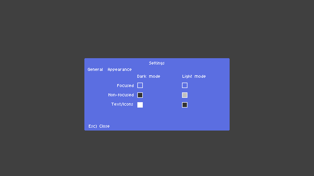

# Tabbed modals & Settings (General / Appearance)

Short plan: shared tab UI → settings uses it → Appearance holds color slots; **color picker is deferred**. **Settings modal size stays fixed** when switching tabs (same panel grid as General).

## 1. Shared tab bar

- New module (e.g. `user_interface/modals/modal_tab_bar.lua`): tabs `{ id, label }`, `activeTabId`, layout + hit-test, draw (active vs inactive).
- **Tab switching:** **mouse only** for now (click a tab). No keyboard shortcut for changing tabs; `Tab` / focus stay for in-content controls only.
- Each tab exposes a small **content interface**: `rebuildLayout`, `draw`, input handlers returning whether the event was consumed; shell handles Esc / backdrop first.

## 2. Settings modal

- Outer shell: backdrop + centered panel = **title** (“Settings”) **+ tab row** (General | Appearance) **+ content area** + footer (**Esc) Close**), pixel-aligned with existing modal chrome.

### Fixed panel footprint (both tabs)

- **One `Panel` spec for General and Appearance:** same **`cols = 3`**, same **`cellW` / `cellH` / padding / gaps**, and the **same total row count** (body rows + footer row) as today’s General settings (`rebuildPanel` in `settings_modal.lua`: label span cols 1–2, control in col 3, footer on last row).
- **Switching tabs must not resize** the modal: no recomputing panel size from tab content. Appearance is laid out **inside this existing grid** (labels, spacers, swatches in col 2–3, `colspan` where needed—same patterns General uses).
- If Appearance needs **fewer** body rows than General, fill the extra rows with **empty cells** (or a single muted “—”) so row count matches. If it ever needs **more**, raise the **canonical** body row count for **both** tabs (General gets padding rows) so they stay locked—avoid asymmetric growth.

### General tab

- Keep the current label/value toggle grid; extract to a tab helper if it keeps `settings_modal.lua` readable.

### Appearance tab (layout — see mock)

- **Logical layout** (from mock): column headers **Dark mode** | **Light mode**; row labels **Focused**, **Non-focused**, **Text/Icons**; one **swatch** per theme×row (six slots). Until the picker exists, swatches are **read-only placeholders** (click may no-op or reserved for future `onRequestColorEdit`).
- **Map this into the fixed 3-column grid** above (e.g. row 0 or 1: header cells; following rows: label col 1, dark swatch col 2, light swatch col 3—or equivalent with `colspan` so it still reads as the mock without changing panel dimensions).
- **Semantics (6 slots):** window/frame focused vs non-focused, and text/icons foreground — per dark vs light columns; exact engine mapping stays in code + `app_colors`.
- **Defaults** (illustrative, from mock): dark — focused blue, non-focused dark grey, text/icons white; light — focused white, non-focused light grey, text/icons dark grey/black.

## 3. Data & `app_colors`

- Persist six overrides (or a small nested table), e.g. keys aligned to **`{ theme: dark|light, slot: focused | non_focused | text_icons }`** — names can match the row/column labels in the UI.
- `app_colors`: load base theme, then **merge** these slots; missing entries use built-in theme defaults.
- Wire window chrome and shared text/icon draw paths to read resolved values for the active app theme + window focus state.

## 4. Controller wiring

- `showSettingsModal` (in `core_controller_save_settings.lua`): add getters/setters or one blob for appearance when persistence exists; stubs can return `{}` until then.

## 5. Color picker (out of scope for first PR)

- Reserve a callback, e.g. `onRequestColorEdit(slotId, currentColor, done)`, with **`slotId`** matching the six grid slots (e.g. `dark_focused`, `light_text_icons`).

## 6. Tests

- Tab switch by **mouse**, General unchanged, Esc closes from any tab, focus sane after tab change.

## 7. Implementation order

1. Tab bar + tab content contract.  
2. Settings shell + General (no behavior change).  
3. Appearance tab: implement the **mock layout inside the shared 3×R panel** (swatches + padding rows as needed) + stub persistence / `app_colors` merge.  
4. Replace hardcoded colors in targeted draw paths.  
5. Plug in your picker when ready.
