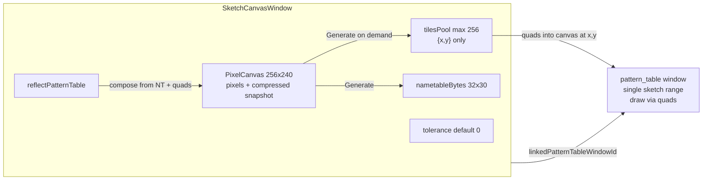

# Sketch Canvas Window

Rename the unused pixel sketch window to Sketch canvas, then implement sketch-owned pattern packing (≤256 `{x,y}` refs into the canvas), link to a pattern table via `linkedPatternTableWindowId`, tolerance-based dedupe, and a reflect-pattern-table view — leaving export/gallery ROM for later.

## Implementation checklist

- [ ] Rename `pixel_sketch_*` → `sketch_canvas_*` (files, kind, APIs, icons, tests)
- [ ] Add `tilesPool` (`{x,y}` only), `nametableBytes`, tolerance, reflect, `linkedPatternTableWindowId` + layout IO
- [ ] Implement on-demand pack/generate with tolerance and PT apply
- [ ] Sketch-sourced single PT range; draw via canvas quads; block CHR drops on linked PT
- [ ] Reflect toggle: compose NT view from canvas quads at pool `{x,y}` without destroying paint buffer
- [ ] New Window entry + sketch toolbar (link, tolerance, generate, reflect)
- [ ] On copy from sketch PT, sample 8×8 from canvas at pool `{x,y}` into frozen clipboard pixels
- [ ] Unit tests for pack, link lock, reflect, persistence


## Current state

`[pixel_sketch_canvas_window.lua](../user_interface/windows_system/pixel_sketch_canvas_window.lua)` is a 256×240 paint canvas (`kind = "pattern_sketch_canvas"`). Painting and layout snapshot already work. Pattern tables only understand ROM CHR ranges. There is no generate/link/reflect path, and sketch is missing from the New Window menu.

## Architecture




**Source of truth for pixels:** only the free pixel canvas (and its existing encoded/compressed snapshot on save). No duplicated pixel payloads in the pool or pattern-table ranges.

**On Generate:** slice the canvas into 8×8 cells (32×30), group similar cells by pixel-diff ≤ `tolerance` (compare by reading from the canvas; do not store those reads). Write up to 256 `{x,y}` entries into `sketch.tilesPool` (canonical cell origin per group) and a full nametable index map. Push that catalog into the linked pattern table as **one** range. Fail with a clear status if unique count exceeds 256 even after tolerance grouping.

**tilesPool entry shape** (lives on the sketch window object, not global `appEditState.tilesPool`):

```lua
{
  x = number,  -- pixel x of representative 8x8 origin on the canvas
  y = number,  -- pixel y
}
```

Display and reflect **sample** the canvas at those origins (Love2D quads / equivalent blit from the canvas image). Clipboard / paste into CHR extracts an 8×8 pixel snapshot **on demand** from the canvas at `{x,y}` — never persisted on the pool entry.

The 32×30 index map (`nametableBytes` on the sketch) picks which pool slot (hence which `{x,y}`) each screen cell uses.

**Link model:** sketch stores `linkedPatternTableWindowId` (same field name as PPU/OAM consumers). Reverse lookup finds which PT is sketch-sourced. That PT:

- Gets a single range derived from the sketch pool (not ROM bank/from/to).
- Rejects CHR/ROM tile drops and other non-sketch appends.
- Still allows copy-drag / clipboard out: copy path samples canvas pixels at the pool `{x,y}` into a frozen clipboard payload so paste into CHR/ROM works.

**Reflect mode:** toggle on the sketch. When on, compose the view from `nametableBytes` + pool `{x,y}` quads into the canvas (shows compression artifacts from tolerance). Painting in reflect mode is disabled (or immediately turns reflect off); default mode remains free paint → generate.

## Phase 0 — Rename (no legacy keep)

Break cleanly; no migration for old `pattern_sketch_canvas` layouts.


| From                              | To                                  |
| --------------------------------- | ----------------------------------- |
| `pixel_sketch_canvas_window.lua`  | `sketch_canvas_window.lua`          |
| `pixel_sketch_canvas_toolbar.lua` | `sketch_canvas_toolbar.lua`         |
| `PixelSketchCanvasWindow`         | `SketchCanvasWindow`                |
| kind `pattern_sketch_canvas`      | `sketch_canvas`                     |
| `createPatternSketchCanvasWindow` | `createSketchCanvasWindow`          |
| `isPatternSketchCanvas`           | `isSketchCanvas`                    |
| titles / icons / tests            | “Sketch canvas”, matching filenames |


Touch points already found: `[window_controller.lua](../controllers/window/window_controller.lua)`, `[window_factory_controller.lua](../controllers/game_art/window_factory_controller.lua)`, `[window_builder_controller.lua](../controllers/game_art/window_builder_controller.lua)`, `[window_capabilities.lua](../controllers/window/window_capabilities.lua)`, `[toolbar_controller.lua](../controllers/window/toolbar_controller.lua)`, layout IO + unit tests.

## Phase 1 — Data model + persistence

On `SketchCanvasWindow`:

- `tilesPool = {}` — max 256 entries of `{x,y}` only
- `nametableBytes` (960 entries after generate; nil/empty until then)
- `tolerance = 0`
- `reflectPatternTable = false`
- `linkedPatternTableWindowId`

Extend `[layout_io_controller](../controllers/game_art/layout_io_controller.lua)` snapshot/restore for these fields (pool `{x,y}` list + nametable + link id + tolerance + reflect flag). **Pixel data continues to use only the existing canvas snapshot encode/decode** — do not add per-tile pixel blobs to layout.

## Phase 2 — Pack / generate controller

New controller e.g. `[controllers/game_art/sketch_canvas_pack_controller.lua](../controllers/game_art/sketch_canvas_pack_controller.lua)`:

- Transiently extract 8×8 via `[PixelCanvas:extractTilePixels](../user_interface/windows_system/pixel_canvas.lua)` for comparison only
- Similarity: pixel-diff count ≤ tolerance (same idea as `[nametable_unscramble_controller.comparePatterns](../controllers/ppu/nametable_unscramble_controller.lua)`)
- Build `tilesPool` as `{x,y}` refs + `nametableBytes`
- Apply to linked PT: set `layers[1].patternTable` to a single sketch-sourced range, then refresh PT display

Wire an on-demand **Generate** action from the sketch toolbar (not continuous while painting).

## Phase 3 — Pattern table sketch range + CHR lock

Extend pattern-table populate so a sketch-sourced range draws each slot by **quad (or blit) from the linked sketch’s canvas** at `tilesPool[i].x/y`, instead of resolving ROM `chrBanksBytes`.

In `[mouse_tile_drop_controller](../controllers/input/mouse_tile_drop_controller.lua)` / `applyChrTileGroupToPatternTableWindow`: if the destination PT is the target of any sketch’s `linkedPatternTableWindowId`, reject CHR appends with a clear toast.

Link/unlink UX: reuse pattern-table link menus where practical; add sketch as a link initiator (toolbar link button → pick/create PT). Persist link like other consumers. Undo event for link + generate.

## Phase 4 — Reflect view

Toolbar toggle `reflectPatternTable`:

- On: compose display from nametable indices + pool `{x,y}` quads into the sketch canvas image (requires a prior generate). Does not invent a second pixel store.
- Off: return to free-paint canvas contents.

Concrete approach: keep `layer.canvas` as the paint buffer always; when reflecting, either (a) temporarily swap to a display canvas built by copying 8×8 regions from paint buffer at each pool `{x,y}` per NT cell, or (b) overlay-draw quads without mutating paint pixels. Prefer (b) if drawing paths allow; else (a) with paint buffer retained on the window so Generate always reads the paint buffer, not the reflect view.

## Phase 5 — UI surface

- Add **Sketch canvas** to `[_buildNewWindowOptions](../controllers/app/core_controller_window_ops.lua)` (icon already exists under windows_icons; rename asset to match).
- Fill `[sketch_canvas_toolbar.lua](../user_interface/toolbars/sketch_canvas_toolbar.lua)`: Link, Tolerance (−/+/field), Generate, Reflect toggle.
- Taskbar / window-icon map entry for `sketch_canvas`.


## Phase 6 — Copy into CHR/ROM

When copying from a sketch-linked pattern table slot, **sample** 8×8 from the sketch canvas at that entry’s `{x,y}` into the existing frozen-pixel clipboard payload, then paste into CHR/ROM as today. Do not require pool entries to hold `.pixels`.

## Out of scope (later)

- CHR / nametable binary export
- Gallery ROM generation
- Auto-generate on every paint stroke
- 8×16 sketch packing (stick to 8×8 for v1)


## Tests (core)

- Rename / kind / create / layout round-trip for sketch fields (pool has only x/y; canvas snapshot still holds pixels)
- Pack with tolerance 0 vs >0 (grouping reduces pool size; nametable indices remap)
- Cap at 256 uniques → error
- Link blocks CHR drop onto that PT
- Reflect compose matches expected regions from canvas at pool coords
- Generate updates linked PT grid item count
- Copy from sketch PT yields pixels matching canvas at `{x,y}`

