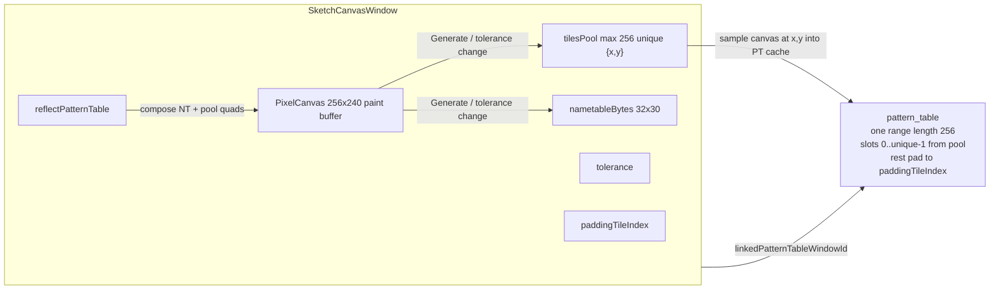

# Sketch Canvas Window — plan

Based on `/home/g/Documents/sketch_canvas_window.txt`. Build and test in small steps; each phase ends with a manual check before the next.

Rename the unused pixel sketch window to **Sketch canvas**, then implement sketch-owned pattern packing into a linked pattern table (always one range of length 256), tolerance-based grouping, reflect view, CHR lock on that PT, and pixel-level copy into CHR/ROM. Export / gallery ROM stay out of scope for v1.

**Scope:** backgrounds / nametables only. Pack and display as **8x8** tiles on a 32x30 map (256x240). No 8x16 / sprite-pair mode for this window.

## Goals (user-facing)

- Free 256x240 paint canvas (painting already works) for background art.
- Link to a **pattern table**; on demand (and when tolerance changes), generate PT items from the paint.
- **Tolerance** (default 0): group similar 8x8 cells by pixel difference so fewer unique patterns fill the PT.
- **Reflect pattern table**: toggle that shows the screen composed from the linked PT / packed nametable (compression artifacts), instead of free paint.
- Linked PT may **only** hold patterns from that sketch (no CHR/ROM drops onto it).
- PT range is always **256 slots**. Unused slots after packing pad by repeating a configurable pool index (`paddingTileIndex` on the sketch window; default 0 = first unique).
- Copy from that PT into CHR/ROM is **pixel paint** (frozen 8x8), not ROM tile references.
- Linked PT still uses a **cached tile-layer canvas** for draw performance.

## Non-goals (later)

- CHR / nametable binary export
- Gallery ROM (N sketch windows -> N nametables, controller L/R, one CHR bank per view)
- Auto-generate on every paint stroke (tolerance change + explicit Generate only)

## Current code (baseline)

- Window: `user_interface/windows_system/sketch_canvas_window.lua` — `kind = "sketch_canvas"`, 256x240 `PixelCanvas`, paint + layout `canvas_snapshot` work.
- Toolbar: `user_interface/toolbars/sketch_canvas_toolbar.lua` — Phase 1 shell (Link / Tolerance / Generate / Reflect placeholders).
- In New Window as **Sketch canvas** (`core_controller_window_ops.lua`).
- Pattern tables today: ROM CHR ranges only (`pattern_table_display_controller.lua` + `window_tile_layer_canvas.lua` cache).
- `linkedPatternTableWindowId` today: PPU/OAM -> PT. Sketch will be a new link initiator -> PT.
- Tolerance model to reuse: `comparePatterns`-style pixel diff in `nametable_unscramble_controller.lua`; canvas helper `PixelCanvas:extractTilePixels`.
- PT -> CHR clipboard today is reference-oriented / paste-restricted; sketch path needs freeze-to-pixels.

## Architecture



**Pixel source of truth:** paint buffer (+ existing compressed canvas snapshot on save). Pool entries are `{x,y}` only — no stored pixel blobs.

**Generate / tolerance regen:**

1. Slice canvas into 32x30 cells of 8x8.
2. Group cells with pixel-diff count <= `tolerance` (compare by reading canvas; do not persist those reads).
3. If unique groups > 256 -> fail with clear status; do not mutate PT.
4. Else write `tilesPool` (canonical `{x,y}` per group) and `nametableBytes` (index into pool).
5. Push into linked PT as **one** sketch-sourced range of length **256**:
   - slots `0 .. #tilesPool-1` -> pool entries
   - slots `#tilesPool .. 255` -> same as `tilesPool[paddingTileIndex + 1]` (1-based Lua) / index `paddingTileIndex` (0-based); clamp/validate against `#tilesPool`
6. Rebuild PT tile-layer canvas cache from those samples.

**Reflect:** compose view from `nametableBytes` + pool `{x,y}` samples. Prefer overlay/compose without destroying paint buffer; Generate always reads paint buffer. Painting while reflect is on: disable paint or turn reflect off.

**Link:** sketch stores `linkedPatternTableWindowId`. Reverse lookup marks PT as sketch-sourced -> reject CHR/ROM appends.

---

## Toolbar ownership

| Control | Window | Notes |
| --- | --- | --- |
| Link / unlink pattern table | Sketch | Pick existing PT or create+link |
| Tolerance (- / + / field) | Sketch | Changing value re-runs pack if linked + paint exists |
| Generate | Sketch | Explicit pack (also useful after paint without changing tolerance) |
| Reflect toggle | Sketch | View-only compose |
| Padding tile index | Sketch or project field only | At least project-persisted; UI can be v1.1 if cramped |
| Pattern table grid chrome (zoom, mirror, etc.) | Pattern table | Keep existing PT toolbar where it still applies |
| CHR drop | Pattern table | Blocked when sketch-linked |

---

## Incremental build (test after each phase)

### Phase 0 — Rename (manual: create/restore still works via code path)

Break cleanly; no migration for old `pattern_sketch_canvas` layouts.

| From | To |
| --- | --- |
| `pixel_sketch_canvas_window.lua` | `sketch_canvas_window.lua` |
| `pixel_sketch_canvas_toolbar.lua` | `sketch_canvas_toolbar.lua` |
| `PixelSketchCanvasWindow` | `SketchCanvasWindow` |
| kind `pattern_sketch_canvas` | `sketch_canvas` |
| `createPatternSketchCanvasWindow` | `createSketchCanvasWindow` |
| `isPatternSketchCanvas` | `isSketchCanvas` |
| titles / icons / tests | "Sketch canvas", matching filenames |

Touch: `window_controller.lua`, `window_factory_controller.lua`, `window_builder_controller.lua`, `window_capabilities.lua`, `toolbar_controller.lua`, layout IO tests, unit tests. Wire icon into taskbar map.

**Manual test:** restore/create sketch via temporary call or layout; paint still works; kind string is `sketch_canvas`.

### Phase 1 — New Window + empty toolbar shell

- Add **Sketch canvas** to `_buildNewWindowOptions` + icon key.
- Toolbar shell with disabled/placeholder Link, Tolerance, Generate, Reflect (no-ops OK).

**Manual test:** New Window -> Sketch canvas opens 256x240; can paint; toolbar visible.

### Phase 2 — Data model + persistence

On `SketchCanvasWindow`:

- `tilesPool = {}` — max 256 `{x,y}`
- `nametableBytes` — 960 entries after generate; nil/empty before
- `tolerance = 0`
- `reflectPatternTable = false`
- `linkedPatternTableWindowId`
- `paddingTileIndex = 0` — which unique slot pads the unused PT indices (0..255)

Layout IO: snapshot/restore these fields. Pixels stay on existing canvas snapshot only.

**Manual test:** set fields in a unit/layout round-trip; reopen project; values stick; pixels still decode.

### Phase 3 — Pack controller (no PT apply yet)

New `controllers/game_art/sketch_canvas_pack_controller.lua`:

- Extract 8x8 via `PixelCanvas:extractTilePixels` for compare only
- Similarity: differing-pixel count <= tolerance
- Build `tilesPool` + `nametableBytes`
- Enforce unique <= 256
- Unit tests: tolerance 0 vs >0, 256 cap error, padding index ignored until PT apply

Wire **Generate** to run pack and show status (`N unique patterns` or error).

**Manual test:** paint two identical 8x8 regions; Generate at tolerance 0 -> 2+ uniques as expected; raise tolerance until they merge; status counts make sense. No PT required yet.

### Phase 4 — Link + apply to pattern table (256 range + pad)

- Sketch Link: pick/create PT, set `linkedPatternTableWindowId`
- After successful pack, apply single sketch range length 256; pad with `paddingTileIndex`
- PT populate samples canvas at pool `{x,y}` into tile items / imgData so **existing tile-layer canvas cache** still works
- Undo for link + generate where practical

**Manual test:** Link PT; Generate; PT shows 256 slots; trailing slots match padding pattern; change paint + Generate updates PT; cache still feels snappy when panning/zooming PT.

### Phase 5 — Tolerance live regen + CHR lock

- Changing tolerance (with link + prior/current paint) re-runs pack + PT apply (debounce if needed)
- Reject CHR/ROM drops onto sketch-linked PT (toast)
- Block other non-sketch appends

**Manual test:** drag CHR tile onto linked PT -> blocked. Move tolerance slider -> PT grid updates without pressing Generate. Unlink -> CHR drop works again on that PT.

### Phase 6 — Reflect view

- Reflect toggle composes from `nametableBytes` + pool samples
- Paint buffer preserved; Generate reads paint buffer
- Reflect off restores free-paint view

**Manual test:** Generate with tolerance > 0; Reflect on -> see merged tiles on screen; Reflect off -> original paint returns; Generate after more paint still uses paint buffer.

### Phase 7 — Pixel copy PT -> CHR/ROM

- Copy/drag from sketch-linked PT freezes 8x8 pixels sampled from sketch canvas at that slot's `{x,y}` (padding slots sample the padding entry's `{x,y}`)
- Paste/drop into CHR/ROM paints those pixels (extend clipboard/drop path as needed; today PT->CHR paste is restricted)

**Manual test:** copy a unique (and a padded) slot into a CHR bank; pixels match the sketch cell; editing sketch afterward does not change already-pasted CHR tiles.

### Phase 8 — Polish + tests

- Toolbar enable/disable rules (Generate needs paint; Reflect needs successful pack; Link states)
- Status strings
- Unit tests listed below
- README short note under windows / New Window if needed

**Manual test:** full happy path from New Window through copy into CHR on a real project save/reload.

---

## Persistence sketch (project fields on sketch window)

```lua
{
  kind = "sketch_canvas",
  linkedPatternTableWindowId = "pt_01", -- optional
  tolerance = 0,
  reflectPatternTable = false,
  paddingTileIndex = 0,
  tilesPool = { { x = 0, y = 0 }, ... }, -- after generate
  nametableBytes = { ... }, -- 960 entries after generate
  -- pixels: existing layer canvas_snapshot encode only
}
```

## Tests (core)

- Rename / kind / create / New Window / layout round-trip (pool is `{x,y}` only)
- Pack tolerance 0 vs >0; nametable indices remap
- Cap at 256 uniques -> error; PT unchanged
- Applied PT range length always 256; padding uses `paddingTileIndex`
- Link blocks CHR drop
- Tolerance change refreshes linked PT
- Reflect compose matches pool coords
- Copy from sketch PT yields pixels matching canvas at `{x,y}` (including padded slots)

## Implementation checklist

- [x] Phase 0 — Rename
- [x] Phase 1 — New Window + toolbar shell
- [x] Phase 2 — Data model + persistence
- [ ] Phase 3 — Pack controller + Generate status
- [ ] Phase 4 — Link + PT apply (256 + pad) + cache
- [ ] Phase 5 — Tolerance live regen + CHR lock
- [ ] Phase 6 — Reflect view
- [ ] Phase 7 — Pixel copy to CHR/ROM
- [ ] Phase 8 — Polish + tests
